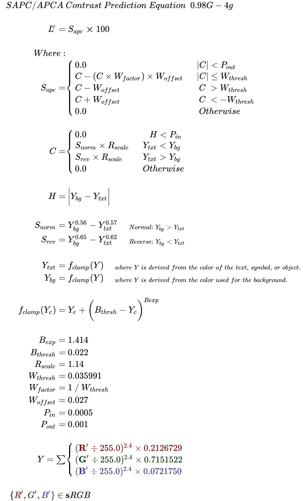

# APCA _THE REVOLUTION WILL BE READABLE™_
## Advanced Perceptual Contrast Algorithm in a nutshell

- APCA was developed independently as a part of the future WCAG 3 standard.
    - APCA uses modern vision science and is perceptually uniform.
    - Studies demonstrate that APCA for WCAG 3 works much better then WCAG 2.x.
    - APCA can be used today, however, WCAG 3 is not the standard yet, and APCA it is _not_ backwards compatible with WCAG 2.x.
        - This is mainly an issue if you have a law to follow that demands WCAG 2 AA as a web standard.
        - Unfortunately WCAG 2 is substantially incorrect in certain areas of perception due to its basis on older standards and technologies. It is due to this that APCA was developed as the replacement for use in WCAG 3, but only partial backwards compatibility is possible.
- The discussion tab is open here if you have questions or comments.
- This repo has the basic APCA code, which returns a perceptually uniform contrast value.
- This iteration has been stable since February, future iterations of course planned.
    - While it is still pre-release beta, the general functioning is demonstratively useful.
    - This version is set for sRGB, a next iteration will change the inputs to allow any additive colorspace.
 - You _CAN_ use APCA simply to evaluate a perceived contrast (such as Lc75). But ALSO:
     - There are a variety of lookup tables that can be used to relate a contrast to a font size and weight.
     - Rounding the contrast to an integer is allowed, and interpolation can be used with a lookup table.
 - For simplicity, you can also use the "simple key levels" method (Lc 45, 60, 75), which compares to WCAG 2 contrast (with one very light color) as:
     - Lc 45 is "sort of" like 3:1
     - Lc 60 is "sort of" like 4.5:1
     - Lc 75 is "sort of" like 7:1
 - Unlike WCAG 2, APCA is polarity aware, so the BG and TEXT colors _must_ be sent to the correct inputs.

Please feel free to use the discussion area for any questions or comments.


## APCA Documentation and Quick Start
See the [JS Documentation \(the ReadMe.md in the JS folder\)](JS/ReadMe.md) for information on using the API, which file is best suited for your needs, and a QuickStart tutorial.

See [WHY APCA](WhyAPCA.md) for a brief explaination of the important differences of APCA for WCAG 3 vs the old WCAG 2.x/1.4.3 contrast guidelines.

## SAPC/APCA CURRENT VERSION: 0.98G Constants: 4g

### October 1, 2021
The base APCA with the 0.98G-4g constants is in the JS folder. 

JS File: APCA_0_98G_4g_minimal.js

### NEW CONSTANTS and NEW MATH:
(October 1, 2021) the 0.98G-4g math and constants have been in use now for months, and by all accounts are working well as expected. The revised code is available in the JS folder. The present version improves tracking of contrast perception. (Doubling or halving the L<sup>c</sup> value results in a perceived doubling or halving of contrast.) Also, smoother results for low contrasts and dark color pairs.

### SAPC and APCA demo tools are live to play with.

**The basic simple version[ is the APCA page,](https://www.myndex.com/APCA/)** it includes the new scaling and the dynamic font matrix. The is the official WCAG3/Silver support version.

**The development version[ is the SAPC page,](https://www.myndex.com/SAPC/)** and this version includes the new RESEARCH MODE, which has some different tools you can activate to investigate the nature of a color or colors, including a simplified version of the middle contrast experiment - on the SAPC app it's called "split contrast mode".

## The New SAPC/APCA at a Glance
- **Now substantially more accurate** in terms of perceptual uniformity — twice as accurate to perception as the APCA we released in 2020.

- **Uniformity Described:** For the majority of the range, doubling or halving the L<sup>c</sup> contrast number equates to a doubling or halving of the perceived contrast. (Based on the empirical data from the 2020 "Middle Contrast" experiments.)

- **New Code and Constants:** If you have been working with the code, it has changed, and there are a whole new set of constants. What was posted here today (Octover 1 2021) is what has been tested on the live sites for several months.

- **Rescaled Output:** This new version sets the levels a little differently, so what was 80 is now about 60, what was 90 is now 75, etc.
    - **Rescaled lookup tables:** — to adjust to the newly scaled output, both the visual lookups, and the arrays in the code are being updated to give accurate font minimums. The d12e tables will suffice for the moment, the revised tables will be up soon.
    - NOTE: the automated lookup tables are not posted here, but are live on the APCA site. 

- Some of the changes have "improved" the accuracy of saturated colors, particularly red and blue, at least in terms of readability guidelines. 
    - APCA is not specifically addressing the Helmholtz–Kohlrausch effect, as the focus for APCA is on readability, and chroma contrast does not help readability for small body-text sized fonts (in some cases it hinders it) — luminance contrast is the key for readability, particularly for body text.
    - I do have a separate color module, but not releasing it at the moment as it is more about aesthetics than readability, and solving the readability issue was the key goal. 

- **Research Mode!** On the SAPC site only, there is a button under the font display for "Research Mode" which activates some additional tools for investigating colors and contrast.

Comments welcome of course. I've opened the discussion tab here on GitHub if you want to have a discussion or questions without opening an issue. Some of the issues that were mainly questions are going to be moved to the discussion tab as well.

Thank you!

Andy

_Andrew Somers_    
_W3 Invited Expert_    
_Myndex Color Science Researcher_    
_Inventor of SAPC and APCA_

-----

## Documentation and Quick Start
See the [JS Documentation \(the ReadMe.md in the JS folder\)](JS/ReadMe.md) for information on using the API, which file is best suited for your needs, and a QuickStart tutorial.

## Important: 
Files that are intended for supporting the Silver/WCAG 3 conformance model all have **W3C** or **WCAG** in the file name.

Files with **RESEARCH** or **DEV** in the name are part of ongoing research and should _NOT_ be used for developing conformance tools, and further are not licensed for use in distributed software, and should be considered experimental only.

### THIS REPOSITORY IS THE ONLY CANONICAL SOURCE OF APPROVED APCA CODE.
If you are integrating code, please check here for official changes. This code is considered beta, and will change periodically.

There are some code listings on some legacy working drafts of Silver aka WCAG 3. These should not be used and are not compatible with the current or future versions. 

### Change Notices:
[ImportantChangeNotices.md]: ImportantChangeNotices.md

If you have been using any files from this repository, be sure to read the file "[ImportantChangeNotices.md]" for critical updates that may affect results.

**Expected changes in a near future version:**
- Change back to a standard linearization method
    - APCA will then take pre-linearized luminance
    - a param of the display color space also to indicate pre-shape
    - this is being done to facilitate easy changing of multiple color spaces
- New "WCAG 2.3+" mode - displays a 1.4.3 _compatible_ pass/fail indicator
    - this will _NOT_ allow the false passes, so contrast will be improved across the board
    - this will not correct all the false fails as that would not conform to WCAG 2.
    - this mode will not be as design flexible as the native APCA
    - font table will have a basic breakpoint, but extended to all weights
- Replace the font lookup tables with a parameterized algorithim
    - lookup table may still be used for defined languages
- New improved, and possibly integrated, reverse contrast (target value)


-----

# What is SAPC/APCA?
[](https://www.myndex.com/WEB/Perception)

## APCA is the _Advanced Perceptual Contrast Algorithm_

APCA is a set of contrast assessment methods for predicting perceived contrast between sRGB colors on a computer monitor. It has been developed as an assessment method for W3 Silver/WCAG3 accessibility standards relating to content for computer displays and mobile devices.

### FEATURES
* NEW in v0.98: Incorporates Spatial Frequency & Stimulus Size directly in predictions (i.e. provides direct indication of minimum font size and weight).
* Spectral weighting of luminance based on sRGB coefficients.
* Weighting for normal and reverse polarity (dark text on light background vs light text on dark.)
* Estimation and weighting of light adaptation for perceptual uniformity in a common "standard observer" model.
* Considers simultaneous contrast and local adaptation based on a pre-estimation model.
* Spatial frequency considerations for font weight as part of calculations and further defined in a lookup table.
* Lookup table can be customised for different languages/character sets.

### FEATURES IN DEVELOPMENT
Soon to be discussed

----- 
### [LIVE VERSION][APCAsite]
There is a working version with examples and reference material on [the APCA site][APCAsite]

NOTE: **The APCA site is using the current G constants**, if you want to compare the current to the old, you can add the word "legacy" to the URL to see legacy mode, which is the 2019/2020 version of APCA.


[][APCAsite]

[APCAsite]: https://www.myndex.com/APCA/

-----
## IMPLEMENTATIONS
The libraries are plain vanilla Javascript. Planned adds include PHP, <s>OpenOffice Calc (spreadsheet)</s> DONE!, and Python, as those cover the most likely use cases. Many of the available inputs to the functions can remain at their defaults, though these extra inputs can be used in more specialized situations (such as creating content specifically for daylight/outdoors, or specifically for dark nights, etc.). 

A plain language walkthrough, LaTeX math, and most basic JS are below:

-----
### Font Use Lookup Table

Font lookup tables are under evaluation. Will post fresh one soon! (In the meantime, you can use LUT version d12e)

[]

[]


### APCA Math (new 0.98G 4g constants)

APCA is the **A**dvanced **P**erceptual **C**ontrast **A**lgorithm. The math assumes the use of the web standard sRGB colorspace.

    0.98G-4g constants:
    
    Exponents:	mainTRC: 2.4	normBG: 0.56	normTXT: 0.57	revTXT: 0.62	revBG: 0.65
    
    Clamps:	blkThrs: 0.022	blkClmp: 1.414	loClip: 0.001	deltaYmin: 0.0005
    
    sRGB:       sRco: 0.2126729    sGco: 0.7151522    sBco: 0.0721750
    
    Scalers:	Scale: 1.14	loBoWthresh: 0.035991	loBoWfactor: 27.7847239587675	loBoWoffset: 0.027	
    

### The Plain English Steps Are:

- Convert the sRGB background and text colors to luminance: Y<sub>background</sub> and Y<sub>text</sub>
    - Convert from 8 bit integer to decimal 0.0-1.0
    - Linearize (remove gamma) by applying a ^2.4 exponent
    - Apply sRGB coefficients and sum to **Y**
        - Y = (R/255)<sup>^2.4</sup> * 0.2126 + (G/255)<sup>^2.4</sup> * 0.7152 + (B/255)<sup>^2.4</sup> * 0.0722
    - We will call these Y<sub>text</sub> and Y<sub>background</sub>
- Determine if Y<sub>text</sub> or Y<sub>background</sub> is brighter (higher luminance, for contrast polarity)
    - Soft-clamp the colors but **only** if it is less than **0.022 Y**
        - **Soft Clamp:** subtract the color **Y** from 0.022 
        - Then apply a ^1.414 exponent to the result
        - Then add that result back to the Y of the darker color
            - clampedY = ( 0.022 - Y )<sup>^1.414</sup> + Y
- Apply power curve exponents to both colors for perceptual contrast
    - For dark text on a light background, use ^0.57 for Y<sub>text</sub> and ^0.56 for Y<sub>background</sub>
    - For light text on a dark background, use ^0.62 for Y<sub>text</sub> and ^0.65 for Y<sub>background</sub>
- Subtract Y<sub>text</sub> from Y<sub>background</sub>
    - **Always** subtract the Y<sub>text</sub> value from the Y<sub>background</sub> value ( BG - TXT )
        - For light text on a dark background, this will generate a negative number. 
        - This is intentional, so that negative values indicate light text on dark BGs, and positive values only indicate dark text on a light BG.  
- Multiply by the scale 1.14
    - THEN if the absolute value is less than threshold 0.035991 return "contrast too low"
    - ELSE if positive, subtract the offset 0.027 and then multiply by 100 for Lc
    - ELSE if negative, add the offset 0.027 and then multiply by 100 for Lc
- Finally: compare the Lc value to the font lookup table for the language being used to determine the minimum font size and weight. 

-----

Basic APCA Math in LaTeX
---------------
0.98G-4g (coming soon)



-----
## Basic Javascript:
In lieu of a pseudocode, here's the most basic JS version:

```
///////////////////////////////////////////////////////////////////////////////
/////
/////    APCA - Advanced Perceptual Contrast Algorithm
/////           Beta 0.98G-4g • contrast function only
/////           DIST: GH SE Revision date: Oct 1, 2021
/////    Function to parse color values and determine Lc contrast
/////    Copyright © 2019-2021 by Andrew Somers. All Rights Reserved.
/////    LICENSE: APCA version to be licensed under W3 cooperative agrmnt.
/////
///////////////////////////////////////////////////////////////////////////////
/////
/////    USAGE:
/////        Use sRGBtoY(color) to convert sRGB to Luminance (Y)
/////        Then send Y-text and Y-background to APCAcontrast(Text, BG)
/////
/////    Lc = APCAcontrast( sRGBtoY(TEXTcolor) , sRGBtoY(BACKGNDcolor) );
/////
/////    Live Demonstrator at https://www.myndex.com/APCA/
/////
////////////////////////////////////////////////////////////////////////////////
/////
/////               DISCLAIMER AND LIMITATIONS OF USE
/////     APCA is an embodiment of certain suprathreshold contrast
/////     prediction technologies and it is licensed to the W3 on a
/////     limited basis for use in certain specific accessibility
/////     guidelines for web content only. APCA may be used for 
/////     predicting colors for web content use without royalty.
/////
/////     However, Any such license excludes other use cases
/////     not related to web content. Prohibited uses include
/////     medical, clinical evaluation, human safety related,
/////     aerospace, transportation, military applications, 
/////     and uses which are not specific to web based content
/////     presented on self-illuminated displays or devices.
/////
////////////////////////////////////////////////////////////////////////////////

//////////   APCA 0.98 G - 4g Constants   //////////////////////////////////////


const mainTRC = 2.4; // 2.4 exponent emulates actual monitor perception
    
const sRco = 0.2126729, 
      sGco = 0.7151522, 
      sBco = 0.0721750; // sRGB coefficients

const normBG = 0.56, 
      normTXT = 0.57,
      revTXT = 0.62,
      revBG = 0.65;  // G-4g constants for use with 2.4 exponent

const blkThrs = 0.022,
      blkClmp = 1.414, 
      scaleBoW = 1.14,
      scaleWoB = 1.14,
      loBoWthresh = loWoBthresh = 0.035991,
      loBoWfactor = loWoBfactor = 27.7847239587675,
      loBoWoffset = loWoBoffset = 0.027,
      loClip = 0.001,
      deltaYmin = 0.0005;


////////// ƒ sRGBtoY() ///////////////////////////////////////////////

function sRGBtoY (sRGBcolor) {
                  // send 8 bit-per-channel integer sRGB (0xFFFFFF)

  let r = (sRGBcolor & 0xFF0000) >> 16,
      g = (sRGBcolor & 0x00FF00) >> 8,
      b = (sRGBcolor & 0x0000FF);
    
  function simpleExp (chan) { return Math.pow(chan/255.0, mainTRC); }
 
		 // linearize r, g, or b then apply coefficients
		// and sum then return the resulting luminance
    
   return sRco * simpleExp(r) + sGco * simpleExp(g) + sBco * simpleExp(b);
}


////////// ƒ APCAcontrast() //////////////////////////////////////////

function APCAcontrast (txtY,bgY) {
                         // send linear Y (luminance) for text and background.
                        // IMPORTANT: Do not swap, polarity is important.
        
  var SAPC = 0.0;            // For raw SAPC values
  var outputContrast = 0.0; // For weighted final values
  
  // TUTORIAL
  
  // Use Y for text and BG, and soft clamp black,
  // return 0 for very close luminances, determine
  // polarity, and calculate SAPC raw contrast
  // Then scale for easy to remember levels.

  // Note that reverse contrast (white text on black)
  // intentionally returns a negative number
  // Proper polarity is important!

//////////   BLACK SOFT CLAMP   /////////////////////////////////////////

          // Soft clamps Y for either color if it is near black.
  txtY = (txtY > blkThrs) ? txtY : txtY + Math.pow(blkThrs - txtY, blkClmp);
  bgY = (bgY > blkThrs) ? bgY : bgY + Math.pow(blkThrs - bgY, blkClmp);

       ///// Return 0 Early for extremely low ∆Y
  if ( Math.abs(bgY - txtY) < deltaYmin ) { return 0.0; }


//////////   APCA/SAPC CONTRAST   ///////////////////////////////////////

  if ( bgY > txtY ) {  // For normal polarity, black text on white (BoW)

           // Calculate the SAPC contrast value and scale
    SAPC = ( Math.pow(bgY, normBG) - Math.pow(txtY, normTXT) ) * scaleBoW;

            // Low Contrast smooth rollout to prevent polarity reversal
           // and also a low-clip for very low contrasts
    outputContrast = (SAPC < loClip) ? 0.0 :
                     (SAPC < loBoWthresh) ?
                      SAPC - SAPC * loBoWfactor * loBoWoffset :
                      SAPC - loBoWoffset;

  } else {  // For reverse polarity, light text on dark (WoB)
           // WoB should always return negative value.

    SAPC = ( Math.pow(bgY, revBG) - Math.pow(txtY, revTXT) ) * scaleWoB;

    outputContrast = (SAPC > -loClip) ? 0.0 :
                     (SAPC > -loWoBthresh) ?
                      SAPC - SAPC * loWoBfactor * loWoBoffset :
                      SAPC + loWoBoffset;
  }

         // Return Lc (lightness contrast) as a signed numeric value.
	// After multipluying by 100, range will be less than ±127,
       // so it is permissible to round to the nearest whole integer.
       
  return  outputContrast * 100.0;
  
} // End APCAcontrast()

```

## TESTING YOUR IMPLEMENTATION

If you've implemented the code and want a quick sanity check, Here are some keystone checks with no rounding. The first color is **TEXT** and the second color is **BACKGROUND**:

```
Test Values for the 0.98G 4g constants, normal and reverse float values for each color pair.
First number is TEXT second number is BACKGROUND.

    TEXT vs BKGND •  EXPECTED RESULT for 0.98 G-4g

    #888 vs #fff  •  63.056469930209424
    #fff vs #888  • -68.54146436644962  

    #000 vs #aaa  •  58.146262578561334
    #aaa vs #000  • -56.24113336839742
    
    #123 vs #def  •  91.66830811481631
    #def vs #123  • -93.06770049484275

    #123 vs #234  •   1.7512243099356113
    #234 vs #123  •  -1.6349191031377903
```

These exercise all the important constants.

-----
## Miscellaneous

### S-Luv Advanced Predictive Color (SAPC) model

* S-Luv, is a L<sup>s</sup> u<sup>s</sup>v<sup>s</sup>-type colorspace for modeling vision and visual impairment perception of emissive displays and devices. 
    * S-Luv is built around the concept of a standard-observer/standard-environment model.
        * the standard observers for visual acuity (VA) with best correction, are grouped as: 
            * 20/12 to 20/20: near-perfect human acuity 
            * 20/20 to 20/40: normal impairment (can drive non-commercial)
            * 20/40 to 20/63: substantial impairment (cannot drive)
            * 20/70 to 20/125+1: Low Vision / disabling impairment
            * Unable to descern ANY character on the 20/100 line: legal definition of blind
                * Note the US SSA allows for acuity testing on log charts which unlike Snellen, have lines between 20/100 and 20/200. The SSA defines statutory blind as unable to descern any character on the 20/100 line, so 20/125+1 (able to see one character on the 20/100 line) does not qualify as statuory blind.
        * The standard observers for visual field (VF) using a III4e stimulus are
            * Greater than 55° temporal and 35° nasal perimeter both eyes (near normal field)
            * Less than 55° temporal and 35° nasal perimeter in either eye (reduced field)
            * Less than 20° perimeter in both eyes, or a -22 dB MD (statutory blind)
        * The standard observers for contrast sensitivity (CSF) are
            * Pelli Robson 2 (normal, 1% threshold)  
            * Pelli Robson 1.5 (impaired, 3% threshold)  
            * Pelli Robson 1 (Low Vision, 10% threshold)
        * The standard observers for Color Vision Deficiency (CVD) are
            * A Protanope (no "red" L cones) is the primary CVD standard observer.
                * Both Protan and Deutan are considered at the same time by using the Protan standard observer, this is because both have similar discrimination issues, but only protan has a significant spectral deficit toward red.
            * Optional additional CVD obervers:
                * A Deuteranope (no "green" M cones)
                * A Tritanope (no "blue" S cones)
                * Blue Cone Monochrmacy is evaluated as low vision / disabling impairment with photophobia and no color discrimination.
* Readability Standard Observer
    * It is important to remember that the listed VA, CSF, & CVD specify the threshold levels between legible and not legible
    * Threshold legibility does not quantify the ideal readability conditions.
        * The critical readability for VA is a stimulus that is 2.4 times larger than threshold acuity.
        * The critical readability for CSF is a stimulus that has 10 times higher contrast than threshold.
        * The critical readability for CVD is a stimulus that has 10 times higher contrast than achromatic threshold, ***after*** adjusting for loss of color discrimination.


### SAPC Standard Observer Monitor and Environment
This is the SAPC standard observer model. This is based on the currently available research and data. We are developing studies to collect additional data, in particular, sampling user settings of their monitor's brightness/contrast and the effect on the resultant display characteristics, and differences in manufacturer implementation of ambient light compensation.

_**The standard environmental model shall comprise**_
* A desktop sRGB LCD screen that is
  * A non-retina display in the sRGB colorspace
  * IPS or equivelent technology such that off-axis viewing is not impacted. 
* Monitor shall be calibrated using a hardware calibrator to:
  * Max White (#FFF) Luminance no less than 160cd/m^2 
  * Max White Luminance no more than 240cd/m^2 
  * Black level (#000) target of 1 cd/m^2 or less, and no more than 2 cd/m^2
  * Preferred gamma target of 2.2, or the sRGB/displayP3 piecewise TRC
     * This is for an actualphysical display. Math models may have a gamma add to compensate for the HVS gamma.
     * This gamma based and the white level to be adjusted in accordance with the ambient levels shown below.
     * An alternate gamma curve may be used for specific testing provided all results so specify.
     * HDR displays are not included in this specification.
* Monitor's surrounding environmental conditions
  * Background behind the monitor and within the users field of view should be neutral grey or white, at a luminance that is 20% of the monitor's maximum white.
  * Ambient light of approximately 200 lux.
    * The light should not _directly_ shine on the face of the monitor.
    * The light should not shine into the eyes of the user while viewing the monitor.
    * What is actually important is that the area within view surrounding the monitor be at 20% luminance of the monitor's max white level. _(If the monitor is surrounded by 80% white walls then it is those 80% walls that need to be at 20% luminance of the monitor's max white as calibrated.)_
  * Ambient evaluation proceedure:  
    * Send the sRGB monitor full screen grey at sRGB value #7C7C7C.
    * The average luminance of the area in view around the monitor should be the same as the monitor grey at #7C7C7C.
    * The monitor at #FFFFFF should measure a luminance approximately five times higher than that measures at #7C7C7C.
  * Position monitor toward user in a way that minimizes reflections.
* Standard observer positioning and desktop monitor resolution.
  * Monitor resolution in ppi shall provide that at the observers view position that:
    * a stimulus that is 18.8px high (CSS reference px) shall subtend 24' (minutes of arc) or 0.4° on the obverver's retina.
      * One CSS reference px is 1.278 minutes of arc or 0.0213°
      * An 18.8px stimulus means the actual size as measured and rendered on the display face.
        * For instance, the glyphs in a font set to  ` font-size: 18.8px; ` does not render as 18px on screen. If the x-height ratio is 0.5, then that means the lower case letters render as only 9px on the display.
        * If the x-height ratio of a font is 0.5875, then setting that font to 32px will result in lower case letters rendering as 18.8px on screen.
      * 24' arc-min is the critical size for a viewer with 20/40 vision for best readability.
      * To determine the critical reading size in arc-min for a given acuity, multiply the lower Snellen number by 0.6.
        * For instance, for 20/70 vision, multiply 70 * 0.6 = 42' arc-min.
      * To determine the actual font size based on acuity, if the font haas an x-height ratio of 0.5875, then multiply the lower Snellen number by 0.8
        * For instance, for 20/60 vision, multiply 60 * 0.8 = 48px font.
          * This isonly if that font has an x-height ratio of 0.5875,
          * The lowercase letters of that 48px font then render to screen at about ~28px.
    * As a quick rule of thumb: **a 16px standard font with an x-height ratio of 0.59 is the critical size for normal vision.**
  * Observer is positioned based on the monitor resolution.
    * For a mobile device, the observer is positioned such that the 1px = 1.278' arc-min relationship is maintained.
    * For a 96ppi monitor, the observer shall be 28" away.
  * For desktop, the monitor should be chosen such that the ppi allows:
    * The observer to be no closer than 24" (60cm)
    * The observer to be no farther than 36" (90cm)


### THIS IS BETA
Being developed for use with future web standards for accessibility. Those standards are under separate repositorieswith the W3/AGWG.

There is an informal and unofficial repository of information on vision, contrast, design, impairments, and readability at the [Visual Contrast Subgroup Wiki] which includes "Whitepaper In Progress" materials.

[Visual Contrast Subgroup Wiki]: https://www.w3.org/WAI/GL/task-forces/silver/wiki/Visual_Contrast_of_Text_Subgroup

The author's website includes further background, including select experimental results and white-papers at https://www.myndex.com/WEB/Perception

-----
## DISCLAIMER

_DISCLAIMER AND LIMITATIONS OF USE:_      
APCA is an embodiment of certain suprathreshold contrast        
prediction technologies. Versions marked as licensed to         
the W3 are strictly limited to web content use only for        
supporting certain accessibility guidelines.

APCA code listed here is provided as is, with no         
warrantees expressed nor implied. We accept no         
liability for any use or misuse of the code.         
Suitability of  purpose resides with the         
integrator or end user.

Commercial use is prohibited without a written         
and signed commercial license agreement.

Non-commercial use is permitted only for         
predicting contrast for web content, no         
other use case is authorized.

License excludes other use cases not related to web         
content. Prohibited uses include and are not limited         
to medical, clinical evaluation, human safety related,         
aerospace, transportation, military applications, and         
uses which are not specific to web-based content         
presented on self-illuminated displays or devices.

-----


Glossary
--------

-   **Light** — visible light is energy in a narrow range of frequencies or wavelengths that can be detected or sensed by "photo sensitive cells" in the back of the eye. 
-   **Color** — color is not real, but a perception or interpretation by visual processing in the brain (in the brain's visual cortex) of stimulus from photosensitive cells in the eye. 
    -   **Hue** — refers to a particular color sensation, i.e. red, green, yellow, blue, etc. Hue does not exist in reality, it is solely the perception of the visual system responding to light of different frequencies.
    -   **Saturation** — the color intensity or purity, reduced by:
        -   **tint** (add white), 
        -   **shade** (add black), 
        -   **tone** (add grey), 
-   **Brightness** — a relative perception, see also perceptual lightness.
-   **Luminance (Y or L)** — a physical measure of visible light intensity. Luminance is mathematically linear as light is in the real world.
-   **Perceived Lightness `(L*)`** — the perception of physical light intensity. Perceptual lightness is mathematically nonlinear in regards to light in the real world, however, some perceptual models attempt to provide a mathematically linear version of perception which then presents light as non-linear. The symbol L* refers to `CIE L*a*b*`, and should not be confused with luminance L.
-   **Luma (*Y'* prime)** — is a gamma encoded, weighted signal used in some video encodings. It is not to be confused with linear luminance.
-   **Gamma** — or transfer curve (TRC) is a curve that is commonly applied to image data for storage or broadcast to reduce perceived noise and improve data utilization.
-   **Contrast** — is a perception of the difference between two objects/elements. There are many forms of contrast, and the different types of contrast interact with and are affected by each other as well as being affected by other aspects of vision.
    -   **Lightness contrast:** the difference in lightness and darkness between two items. This is a particularly important form of contrast for information such as text.
    -   **Spatial contrast:** in other words contrasts of size. Size contrasts directly affect the perception of lightness contrasts.
    -   **Hue contrast:** the perception of different light frequencies. Hue contrasts are three times weaker than lightness contrasts, and some people have problems perceiving some hues, so hue should never be a primary design contrast.
    -   **Positional contrasts:** the distance and/or orientation between objects is important in object recognition and identification.
    -   **Temporal contrasts:** contrasts of time, speed, and change. 
-   **Visual Acuity** — acuity refers to the ability of the eye's optics to focus light onto the photoreceptors on the back of the eye.
    -   Poor acuity is usually understood as blurry vision or an inability to focus.
-   **Spatial Frequency** — in a practical sense, this refers to the weight of a font, or the stroke width. A thinner font or narrower stroke width is a higher spatial frequency than a bolder or thicker stroke. Higher spatial frequencies require more luminance contrast to be visible than lower frequencies, such as a very bold large headline.


