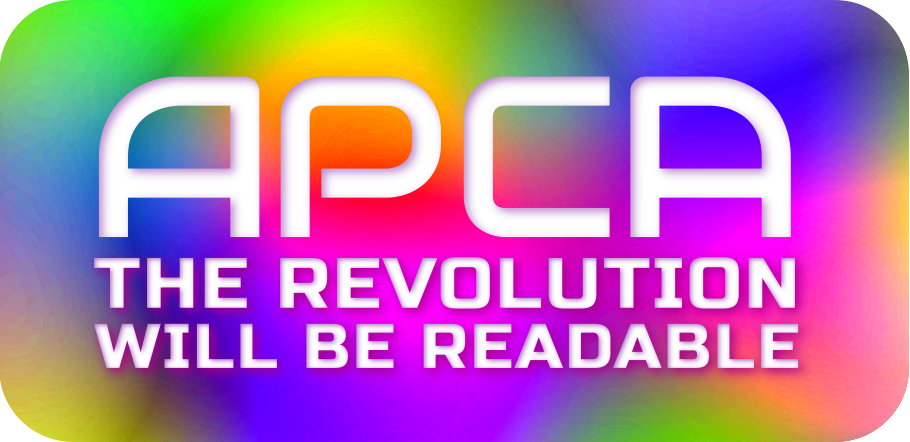

   
  
   &nbsp;&nbsp;
   &nbsp;&nbsp;
   &nbsp;&nbsp;
   &nbsp;&nbsp;
   &nbsp;&nbsp;
  

# APCA • SAPC • SARCAM PRIMARY REPOSITORY
Please make all comments or discussions here and not in the satellite repositories.

## NEW! Bridge PCA
Do you want to improve readability, but you are forced to used WCAG 2 contrast to the letter? Then Bridge PCA is for you. It is backward compatible with WCAG 2, but using APCA technology.
SEE: [**_Bridge PCA Repository_**](https://github.com/Myndex/bridge-pca) 

## NEW! _W3 Licensed Files Moved_
**All files that are part of and licensed to the W3 and AGWG, in support of WCAG&nbsp;3, are now in their own repository.**

SEE: [**_APCA W3 Repository_**](https://github.com/Myndex/apca-w3) and please source all files for tools intended for WCAG&nbsp;3 conformance from that specific repository. The files in this repositiory are part of other projects, and not necessary for WCAG&nbsp;3 compliance.

----
## DIRECTORY

### Source and Data
- JS arrays and tab-delimited data of the font Lookup tables is [in the data folder](./data/).
- The APCA and BridgePCA web-tools are  [in the WEBTOOLS folder](./WEBTOOLS/).
- There are ported versions [in the src/ported folder](./src/ported/).

### Documentation
- [Why APCA?](./documentation/WhyAPCA.md)
- [APCAinanutshell](./documentation/APCAinanutshell.md)
- [Main Readme Doc](./documentation/README.md)
- [RepoList](./documentation/repoList.md)
- [ImportantChangeNotices](./documentation/ImportantChangeNotices.md)
- [How to Contribute](./documentation/CONTRIBUTING.md)
- [APCA FAQ](./documentation/APCA_FAQ.md)
- [License](./documentation/LICENSE.md)

### Related Repositories
- [**_APCA W3 Repository_**](https://github.com/Myndex/apca-w3) The W3 version for web content
- [**_Bridge PCA Repository_**](https://github.com/Myndex/bridge-pca) Bridge&nbsp;PCA - the WCAG&nbsp;2 compatible version
- [**_Color Parsley Repository_**](https://github.com/Myndex/colorparsley) Fast and easy color string parsing — a NodeJS dependency for many of the SAPC libraries.

### Got Questions? We Got Answers!
- [**_Open a discussion today!_**](https://github.com/Myndex/SAPC-APCA/discussions)

## Accessible Perceptual Contrast Algorithm in a nutshell
APCA was developed independently as a part of the future WCAG&nbsp;3 standards, with the guidance and oversight of members of the W3 AGWG, Members of the US Access Board, and members of the accessibility community at large. All participants, beta testers, early adopters, are deeply thanked for their comments and contributions to the development of the APCA. Readability is for all!

## OTHER RESOURCES
There is an informal repository of information on vision, contrast, design, impairments, and readability at the [Visual Contrast Subgroup Wiki] which includes "Whitepaper In Progress" materials.

For a deeper dive into color see the author's whitepaper ["Introduction to Color and Accessibility"](https://developer.mozilla.org/en-US/docs/Web/Accessibility/Understanding_Colors_and_Luminance#introduction_to_color_and_accessibility)

[The draft APCA white paper](https://www.w3.org/WAI/GL/task-forces/silver/wiki/Visual_Contrast_of_Text_Subgroup/Whitepaper).

[Visual Contrast Subgroup Wiki]: https://www.w3.org/WAI/GL/task-forces/silver/wiki/Visual_Contrast_of_Text_Subgroup

The [author's website](https://www.myndex.com/WEB/Perception) includes further background, including select experimental results and white-papers.

### _Comparitive Contrast Articles_ 

The problems of 4.5:1 as a target for a guideline not only impact accessibility, but impacts standard vision. The inherent problems with the WCAG&nbsp;2 contrast math have been known for some time and [widely critisized](https://macwright.com/2019/03/30/color-contrast-is-a-problem.html). Including studies [by others showing that color insensitive types](https://www.bounteous.com/insights/2019/03/22/orange-you-accessible-mini-case-study-color-ratio/) are not well served. The WCAG&nbsp;2 contrast specs often cause enough problems for designers [that it is ignored](https://uxmovement.com/buttons/the-myths-of-color-contrast-accessibility/) and today, some 86% of websites are failing WCAG\_2 contrast—though some of these failures are not due to actually poor accessibility, but due to the incorrect math of WCAG\_2 contrast.

**_Additional comparisons and discussions by this author:_**
- [**What’s Red & Black & Also Not Read?**](https://atangledwebweweave.com/whats-red-black-also-not-read-573b9c0a97ed) on Tangled Web, which examines the nature of color insensitivity and readability.
- [**A Contrast of Errors**](https://atangledwebweweave.com/a-contrast-of-errors-373c2665d42a) on Tangled Web, which looks at the history and the current international readability crisis.
- Part I: [**Orange You Wondering About Contrast?**](https://gist.github.com/Myndex/1dadb6dcac596f1cd7a5686a076f697f) Answering some contrast questions, and demonstrating a real solution to the infamous orange conundrum.
- Part II: [**The Lighter Side of Dark Backgrounds**](https://gist.github.com/Myndex/c30dba273aa5eca426ad9f5200917c9d) An article comparing some parts of APCA with the old WCAG&nbsp;2 contrast methods, demonstrating how WCAG&nbsp;2 contrast can cause poor results.
- Part III: [**WCAG&nbsp;2 vs APCA Contrast Shootout**](https://gist.github.com/Myndex/069a4079b0de2930e72d5401bde9af98#wcag-2-vs-apca-contrast-shootout) Answering some recent questions regarding APCA, with comparisons and examples of the old (WCAG&nbsp;2 1.4.3) and the future WCAG&nbsp;3 / APCA.

Basic APCA Math in LaTeX
----------
0.0.98G-4g-build-3

### _THE REVOLUTION WILL BE READABLE_™

 

