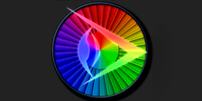
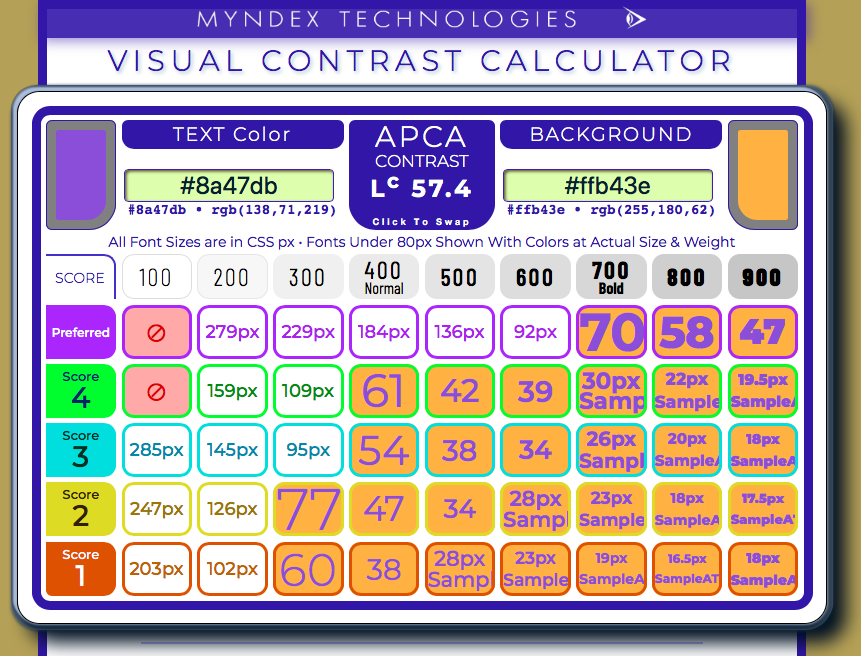
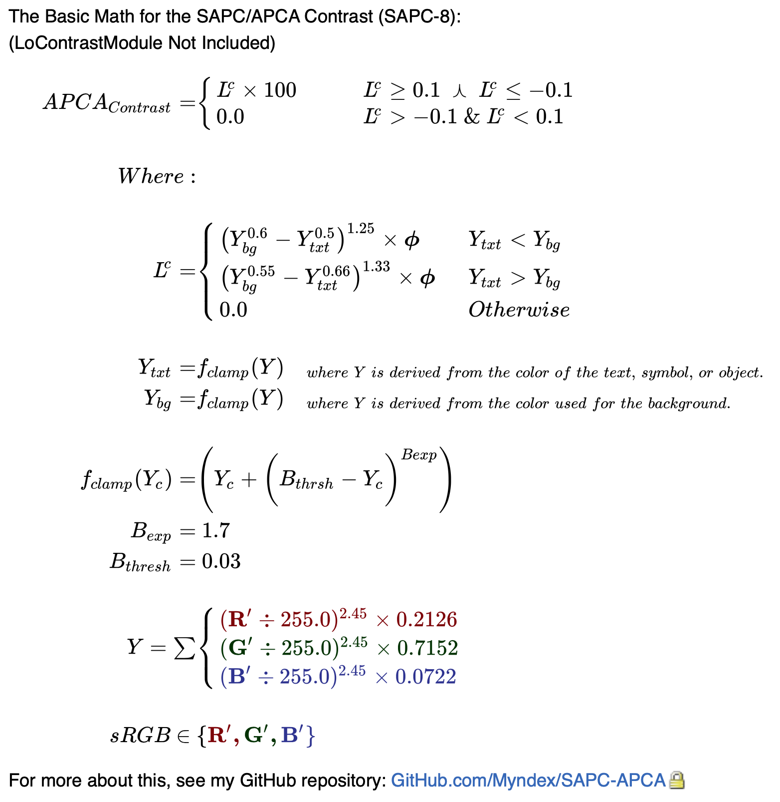

## PRE-RELEASE CONSTANTS:
As of today,  (January 17, 2021) we have a new set of candidate constants for the exponents, a key critical aspect of APCA. These substantially improve tracking of contrast perception especially for low contrasts and dark color pairs, make the contrast prediction significantly more accurate, and along with some upcoming code tweaks will provide a wider range as well.

I'm _not_ going to post them here by themselves, as implementation requires a number of changes to the algorithim.

### Revised Constants v0.98d12c:

**To see the D12c version of the constants**, visit: https://www.myndex.com/SAPC/  _(the old constants are still on the [**APCA**][APCAsite] link)_

***About the New Constants and Upcoming Code Change***

* Superior tracking in low contrast, approaching clinical levels for threshold contrasts.
* All previous levels have been rescaled. Essentially "down 20" such that what was Lc80 is now Lc60, and so forth.
* All lookup tables (visible and in the code) have been updated to match.
* There is a new elegant scaling method that helps acheive all this.
* While the basic model and concept is the same, the algorithim has enough changes that just replacing the constants will not work, and will have unpredictible results. I will post a canonical version here later this week after some futher evaluations, but of course feel free to look at the myndex.com/SAPC/ link to see what's up. 
* It's spread between the HTML and the JS file for now, I will integrate soon.

***ALSO*** The SAPC version has a "research mode" that has some useful contrast related utilities.

---

## SAPC CURRENT VERSION: 0.98D under revision/eval. 
On hold while the new constants and modified math are evaluated. Coming very soon!

## APCA CURRENT VERSION: Beta 0.98
## (Nov 18, 2020, 08:00 GMT) 
To be replaced as soon as the D series constants are evaluated.

-----

## NEW - Documentation and Quick Start
See the [JS Documentation \(the ReadMe.md in the JS folder\)](JS/ReadMe.md) for information on using the API, which file is best suited for your needs, and a QuickStart tutorial.

## Important: 
Files that are intended for supporting the Silver/WCAG 3 conformance model all have **APCA** in the file name. Files with SAPC in the name are part of ongoing research and should _NOT_ be used for developing conformance tools.

### Change Notices:
[ImportantChangeNotices.md]: ImportantChangeNotices.md

If you have been using any files from this repository, be sure to read the file "[ImportantChangeNotices.md]" for critical updates that may affect results.

-----

# SAPC/APCA

## SAPC _(S-LUV Advanced Perceptual Contrast)_
### APCA _Advanced Perceptual Contrast Algorithm_

This is a set of contrast assessment methods for predicting perceived contrast between sRGB colors on a computer monitor. It has been developed as an assessment method for W3 Silver/WCAG3 accessibility standards relating to content for computer displays and mobile devices.

### FEATURES
* NEW in v0.98: Incorporates Spatial Frequency & Stimulus Size directly in predictions (i.e. provides direct indication of minimum font size andf weight).
* Spectral weighting of luminance based on sRGB coefficients.
* Weighting for normal and reverse polarity (dark text on light background vs light text on dark.)
* Estimation and weighting of light adaptation for perceptual uniformity in a common "standard observer" model.
* Considers Bartleson Breneman surround effects, simultaneous contrast, and local adaptation based on a pre-estimation model.
* Spatial frequency considerations for font weight as part of calculations and defined in a lookup table.

### FEATURES IN DEVELOPMENT
* Additional weighting for RED/GREEN/BLUE to enhance contrast for accommodating Color Vision Deficiencies, glare, and provide better design guidance.
* <s>Incorporate Spatial Frequency & stimulus size directly in predictions (no lookup table).</s> DONE! New for 0.98
* Calculate multi-way contrasts and total effective page luminances for dynamic calculation of surround effects, simultaneous contrast, and local adaptation.
* Calculate the effect of opacities.

----- 

### [LIVE VERSION][APCAsite]
There is a working version with examples and reference material on [the APCA site][APCAsite]

NOTE: **The APCA site is using the old (pre 98charlie) constants**, useful if you want to comapre; APCA will be revised after the constants undergo further evaluation.

[][APCAsite]

[APCAsite]: https://www.myndex.com/APCA/

-----

## IMPLEMENTATIONS
The libraries are plain vanilla Javascript. Planned adds include PHP, OpenOffice Calc (spreadsheet), and Python, as those cover the most likely use cases. Many of the available inputs to the functions can remain at their defaults, though these extra inputs can be used in more specialized situations (such as creating content specifically for daylight/outdoors, or specifically for dark nights, etc.). 

A plain language walkthrough, LaTeX math, and pseudocode are below:

-----

### Lookup Table — D

[]

### APCA Math (new 0.98d-trial constants)

APCA is the **A**dvanced **P**erceptual **C**ontrast **A**lgorithm. The math assumes the use of the web standard sRGB colorspace.

### The Plain English Steps Are:

- Convert the sRGB background and text colors to luminance: Ybackground and Ytext
    - Convert from 8 bit integer to decimal 0.0-1.0
    - Linearize (remove gamma) by applying a ^2.4 exponent
    - Apply sRGB coefficients and sum to **Y**
        - Y = (R/255)^2.4 * 0.2126 + (G/255)^2.4 * 0.7152 + (B/255)^2.4 * 0.0722
    - We will call these Ytext and Ybackground
- Determine if Ytext or Ybackground is brighter (higher luminence, for contrast polarity)
    - Soft-clamp only the darkest color and **only** if it is less than **0.02 Y**
        - **Soft Clamp:** subtract the darker color **Y** from 0.03
        - Then apply a ^1.7 exponent to the result
        - Then add that result back to the Y of the darker color
            - (0.03 - Y)^1.7 + Y
- Apply power curve exponents to both colors for perceptual contrast
    - For dark text on a light background, use ^0.44 for Ytext and ^0.42 for Ybackground
    - For light text on a dark background, use ^0.5 for Ytext and ^0.52 for Ybackground
- Subtract Ytext from Ybackground, raise to power of phi, then multiply by phi (1.618) to scale the contrast value
    - **Always** subtract the Ytext value from the Ybackground value. 
        - For light text on a dark background, this will generate a negative number. 
        - This is intentional, so that negative values only apply to light text on dark BGs, and positive values only apply to dark text on a light BG.  

**For dark text on a lighter background:**
- If the result is less than 0.002, then set contrast as 0. Otherwise multiply by 100.     
    - Lccontrast = (Ybackground^0.42 - Ytext^0.44) * 1.618 * 100
    
**For light text on a darker background:**
- If the result is greater than -0.002 (closer to 0), then set contrast as 0. Otherwise multiply by 100.     
    - Lccontrast = (Ybackground^0.52 - Ytext^0.5) * 1.618 * 100
	

-----

Basic APCA Math in LaTeX
---------------
(this has not been updated with the new constants yet)

-----

Basic SAPC Math Pseudocode
--------------------------

In the sRGB colorspace, using CSS color values as integers, with a background color sRGBbg and a text color sRGBtxt convert each channel to decimal 0.0-1.0 by dividing by 255, then linearize the gamma encoded RGB channels by applying a simple exponent. 2.4 is used here as it best emulates the typical display to eye trc.

	Rlinbg = (sRbg/255.0) ^ 2.4
	Glinbg = (sGbg/255.0) ^ 2.4
	Blinbg = (sBbg/255.0) ^ 2.4

	Rlintxt = (sRtxt/255.0) ^ 2.4
	Glintxt = (sGtxt/255.0) ^ 2.4
	Blintxt = (sBtxt/255.0) ^ 2.4

Then find the relative luminance (*Y*) of each color by applying the sRGB/Rec709 spectral coefficients and summing together.

	Ybg = 0.2126 * Rlinbg + 0.7152 * Glinbg + 0.0722 * Blinbg

	Ytxt = 0.2126 * Rlintxt + 0.7152 * Glintxt + 0.0722 * Blintxt

### Predicted Contrast

The Predicted Visual Contrast (*SAPC*) between a foreground color and a background color is calculated by:

	//  Define Constants for Basic SAPC Version:

	trcExpon = 2.4;			// Linearization exponent
					
	normBGexp = 0.42;		// Constants for Power Curve Exponents.
	normTXTexp = 0.44;		// One pair for normal text, dark text on light BG
	revBGexp = 0.52;		// and one for reverse, light text on dark BG
	revTXTexp = 0.5;

	scale = 1.618;          // Scale output for easy to remember levels

	blkThrs = 0.03;			// Level that triggers the soft black clamp
	blkClmp = 1.7;			// Exponent for the soft black clamp curve
	loClip = 0.0005;

	// Soft clamp very dark colors
	
		Ytxt = (Ytxt > blkThrs) ? Ytxt : Ytxt + a((blkThrs - Ytxt) ^ blkClmp);
		Ybg = (Ybg > blkThrs) ? Ybg : Ybg + ((blkThrs - Ybg) ^ blkClmp);

	// Calculate Predicted Contrast and return a string for the result

	if Ybg > Ytxt then {

		SAPC = ( Ybg^normBGexp - Ytxt^normTXTexp )^scale;
	
		return (SAPC < loClip ) ? "LOW" : str(SAPC * scale * 100) + " Lc";
	
	} else {
  
		SAPC = ( Ytxt^revTXTexp - Ybg^revBGexp )^scale;
	
		return (SAPC < loClip ) ? "-LOW" : str(SAPC * scale * -100) + " Lc";
	}

*Notes:*

*Piecewise linearization is not used, as the combination of exponents used throughout better models actual display performance and contrast perception.*

*Predicted contrast less than 5% is clamped to zero to simplify the math and reduce noise.* 

*The "^" character is the exponentiation operator.*

*****

## Miscellaneous

There is an informal and unofficial repository of information on vision, contrast, design, impairments, and readability at the [Visual Contrast Subgroup Wiki] which includes "Whitepaper In Progress" materials.

[Visual Contrast Subgroup Wiki]: https://www.w3.org/WAI/GL/task-forces/silver/wiki/Visual_Contrast_of_Text_Subgroup

The author's website includes further background, including select experimental results and white-papers at https://www.myndex.com/WEB/Perception

Glossary
--------

-   **Light** — visible light is energy in a narrow range of frequencies or wavelengths that can be detected or sensed by "photo sensitive cells" in the back of the eye. 
-   **Color** — color is not real, but a perception or interpretation by visual processing in the brain (in the brain's visual cortex) of stimulus from photosensitive cells in the eye. 
    -   **Hue** — refers to a particular color sensation, i.e. red, green, yellow, blue, etc. Hue does not exist in reality, it is solely the perception of the visual system responding to light of different frequencies.
    -   **Saturation** — the color intensity or purity, reduced by:
        -   **tint** (add white), 
        -   **shade** (add black), 
        -   **tone** (add grey), 
-   **Brightness** — a relative perception, see also perceptual lightness.
-   **Luminance (Y or L)** — a physical measure of visible light intensity. Luminance is mathematically linear as light is in the real world.
-   **Perceived Lightness `(L*)`** — the perception of physical light intensity. Perceptual lightness is mathematically nonlinear in regards to light in the real world, however, some perceptual models attempt to provide a mathematically linear version of perception which then presents light as non-linear. The symbol L* refers to `CIE L*a*b*`, and should not be confused with luminance L.
-   **Luma (*Y'* prime)** — is a gamma encoded, weighted signal used in some video encodings. It is not to be confused with linear luminance.
-   **Gamma** — or transfer curve (TRC) is a curve that is commonly applied to image data for storage or broadcast to reduce perceived noise and improve data utilization.
-   **Contrast** — is a perception of the difference between two objects/elements. There are many forms of contrast, and the different types of contrast interact with and are affected by each other as well as being affected by other aspects of vision.
    -   **Lightness contrast:** the difference in lightness and darkness between two items. This is a particularly important form of contrast for information such as text.
    -   **Spatial contrast:** in other words contrasts of size. Size contrasts directly affect the perception of lightness contrasts.
    -   **Hue contrast:** the perception of different light frequencies. Hue contrasts are three times weaker than lightness contrasts, and some people have problems perceiving some hues, so hue should never be a primary design contrast.
    -   **Positional contrasts:** the distance and/or orientation between objects is important in object recognition and identification.
    -   **Temporal contrasts:** contrasts of time, speed, and change. 
-   **Visual Acuity** — acuity refers to the ability of the eye's optics to focus light onto the photoreceptors on the back of the eye.
    -   Poor acuity is usually understood as blurry vision or an inability to focus.
-   **Spatial Frequency** — in a practical sense, this refers to the weight of a font, or the stroke width. A thinner font or narrower stroke width is a higher spatial frequency than a bolder or thicker stroke. Higher spatial frequencies require more luminance contrast to be visible than lower frequencies, such as a very bold large headline.

-----

### S-Luv/S-Lab

* S-Luv, is a Ls usvs-type colorspace for modeling vision and visual impairment perception of emissive displays and devices. 
    * S-Luv is built around the concept of a standard-observer/standard-environment model.
        * the standard observers for visual acuity (VA) are grouped as: 
            * 20/40 and better (near normal), 
            * 20/40 through 20/80 (transitional impairment) and
            * 20/80 to 20/200 (Low Vision)
        * The standard observers for contrast sensitivity (CSF) are
            * Pelli Robson 2 (normal, 1% threshold)  
            * Pelli Robson 1.5 (impaired, 3% threshold)  
            * Pelli Robson 1 (Low Vision, 10% threshold)
        * The standard observers for Color Vision Deficiency are
            * A Protanope (no red cones)
            * A Deuteranope (no green cones)
            * Both Protan and Deutan are addressed at the same time.
            * The standard observers for contrast sensitivity are (under revision / TBD)
        * It is important to remember that VA and CSF are the threshold levels between legible and not legible, but do not specify the idea readability conditions.
 

### SAPC Standard Observer Monitor (preliminary)
These are preliminary thoughts for a standard observer model. In particular, some further research and empirical studies that sample how users tend to set their monitor's brightness/contrast and the effect on the resultant display gamma/TRC.

* The standard environmental model is a desktop sRGB LCD screen calibrated for 
   * Max White (#FFF) Luminance no less than 160cd/m^2 
   * Max White Luminance no more than 240cd/m^2 
   * Black level target of 1 cd/m^2, and no more than 2 cd/m^2
   * Gamma curve of no less than 2.2, and no more than 2.5
   * Preferred gamma target similar to L*, between 2.3 and 2.4
   * Ambient light of approximately 200 lux.
       * The light should not _directly_ shine on the face of the monitor.
       * The light should not shine into the eyes of the user while viewing the monitor.
       * The previous 18% greycard method was deleted as being problematic.
       * What is actually important is that the area within view surrounding the monitor be at 20% luminance of the monitor's max white level. If the monitor is surrounded by 80% white walls then it is those 80% walls that need to be at 20% luminance of the monitor's max white as calibrated.
      * Send the sRGB monitor full screen grey at sRGB value #7C7C7C.
      * The average luminance of the area in view around the monitor should be the same as the monitor grey at #7C7C7C.
      * The monitor at #FFFFFF should measure a luminance approximately five times higher than that measures at #7C7C7C.
   * Position monitor toward user in a way that minimizes reflections.
   * Background behind the monitor within the users field of view should be neutral, and about 20% of the monitor's maximum white luminance.

### THIS IS BETA
Being developed for use with future web standards for accessibility. Those are under separate repositories.
