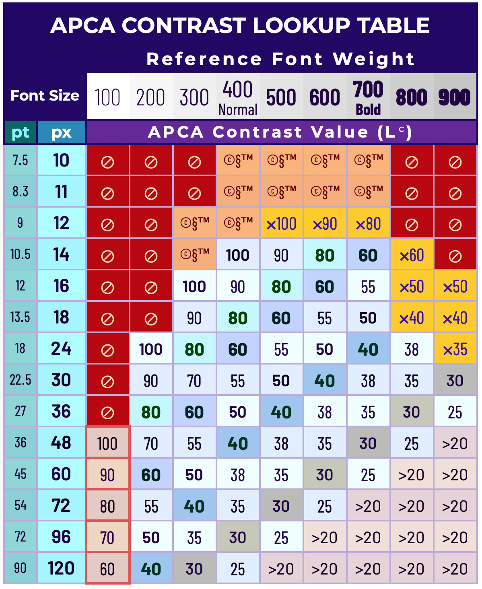
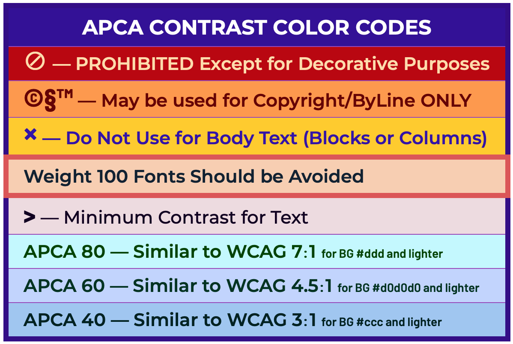
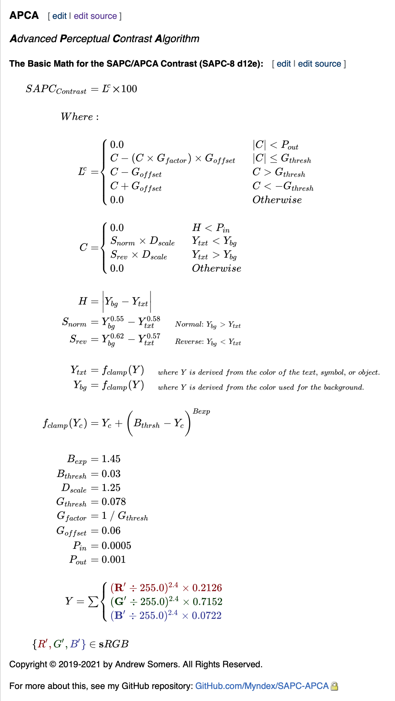

# _THE REVOLUTION WILL BE READABLE™_

## SAPC/APCA CURRENT VERSION: 0.98e Constants: d12e
### January 28, 2021  02:13 GMT

JS File: APCAonly.98e_d12e.js

### NEW CONSTANTS and NEW MATH:
As of today,  (January 25, 2021) we have a new set of constants for the exponents, a key critical aspect of APCA, plus a new scaling method, and other revised code as the result of some recent breakthrough experiments. These substantially improve tracking of contrast perception, and better predicts for low contrasts and dark color pairs.

Only the pseudocode and LaTeX math below are updated — I'll get ready to go JS files here soon... let me clean up the leftover development gack and get the files in order, but if you want instant gratification.....

### It's Alive!
The "new improved" SAPC and APCA are now live to play with. There have been some substantial changes and I'm excited to share:

### What and Where
**The basic simple version[ is the APCA page,](https://www.myndex.com/APCA/)** it includes the new scaling and the dynamic font matrix. The is the official WCAG3/Silver support version.

**The development version[ is the SAPC page,](https://www.myndex.com/SAPC/)** and this version includes the new RESEARCH MODE, which has some different tools you can activate to investigate the nature of a color or colors, including a simplified version of the middle contrast experiment - on the SAPC app it's called "split contrast mode".

## The New SAPC/APCA at a Glance
- **Now substantially more accurate** in terms of perceptual uniformity — twice as accurate to perception as the APCA I released last year.

- **Uniformity Described:** For the majority of the range, doubling or halving the Lc contrast number equates to a doubling or halving of the perceived contrast. (Based on the empirical data from the 2020 "Middle Contrast" experiments.)

- **New Code and Constants:** If you have been working with the code, it has changed, and there are a whole new set of constants. I have not posted it here on GitHub yet, but you can see it in the live sites.

- **Rescaled Output:** This new version sets the levels a little differently, so what was 80 is now about 60, and so on.
    - **Rescaled lookup tables:** — to adjust to the newly scaled output, both the visual lookups, and the arrays in the code are updated to give accurate font minimums.

- **Full range is now standard** implemented via a new method that brings in the uniformity (doubling/halving). 
    - And by full range, I mean all the way to zero, including a smooth crossing over zero. 
    - While 8 bit monitors are too low in resolution for actual clinical accuracy, we are now measuring down to clinical threshold values. 

- Some of the changes have "improved" the accuracy of saturated colors, particularly red and blue, at least in terms of readability guidelines. 
    - APCA is not specifically addressing the Helmholtz–Kohlrausch effect, as the focus for APCA is on readability, and chroma contrast does not help readability (in some cases it hinders it) — luminance contrast is the key for readability.
    - I do have a separate color module, but not releasing it at the moment as it is more about aesthetics, not readability, and solving the readability issue was the key goal, which I believe is achieved. 

- **Research Mode!** On the SAPC site only, there is a button under the font display for "Research Mode" which activates some additional tools for investigating colors and contrast.

Comments welcome of course. 

Thank you!

Andy

_Andrew Somers 
W3 Invited Expert 
Myndex Color Science Researcher 
Inventor of SAPC and APCA_

-----

## Documentation and Quick Start
See the [JS Documentation \(the ReadMe.md in the JS folder\)](JS/ReadMe.md) for information on using the API, which file is best suited for your needs, and a QuickStart tutorial.

## Important: 
Files that are intended for supporting the Silver/WCAG 3 conformance model all have **APCA** in the file name. Files with SAPC in the name are part of ongoing research and should _NOT_ be used for developing conformance tools.

### Change Notices:
[ImportantChangeNotices.md]: ImportantChangeNotices.md

If you have been using any files from this repository, be sure to read the file "[ImportantChangeNotices.md]" for critical updates that may affect results.

-----

# SAPC/APCA

## SAPC _(S-LUV Advanced Perceptual Contrast)_
### APCA _Advanced Perceptual Contrast Algorithm_

This is a set of contrast assessment methods for predicting perceived contrast between sRGB colors on a computer monitor. It has been developed as an assessment method for W3 Silver/WCAG3 accessibility standards relating to content for computer displays and mobile devices.

### FEATURES
* NEW in v0.98: Incorporates Spatial Frequency & Stimulus Size directly in predictions (i.e. provides direct indication of minimum font size andf weight).
* Spectral weighting of luminance based on sRGB coefficients.
* Weighting for normal and reverse polarity (dark text on light background vs light text on dark.)
* Estimation and weighting of light adaptation for perceptual uniformity in a common "standard observer" model.
* Considers Bartleson Breneman surround effects, simultaneous contrast, and local adaptation based on a pre-estimation model.
* Spatial frequency considerations for font weight as part of calculations and defined in a lookup table.

### FEATURES IN DEVELOPMENT
* Additional weighting for RED/GREEN/BLUE to enhance contrast for accommodating Color Vision Deficiencies, glare, and provide better design guidance.
* <s>Incorporate Spatial Frequency & stimulus size directly in predictions (no lookup table).</s> DONE! New for 0.98
* Calculate multi-way contrasts and total effective page luminances for dynamic calculation of surround effects, simultaneous contrast, and local adaptation.
* Calculate the effect of opacities.

----- 

### [LIVE VERSION][APCAsite]
There is a working version with examples and reference material on [the APCA site][APCAsite]

NOTE: **The APCA site is now using current constants**, if you want to comapre the current to the old, you can add the word "legacy" to the URL to see legacy mode.

[][APCAsite]

[APCAsite]: https://www.myndex.com/APCA/

-----

## IMPLEMENTATIONS
The libraries are plain vanilla Javascript. Planned adds include PHP, OpenOffice Calc (spreadsheet), and Python, as those cover the most likely use cases. Many of the available inputs to the functions can remain at their defaults, though these extra inputs can be used in more specialized situations (such as creating content specifically for daylight/outdoors, or specifically for dark nights, etc.). 

A plain language walkthrough, LaTeX math, and pseudocode are below:

-----

### Lookup Table — D

[]

[]

### APCA Math (new 0.98d12e constants)

APCA is the **A**dvanced **P**erceptual **C**ontrast **A**lgorithm. The math assumes the use of the web standard sRGB colorspace.

    Exponents:	mainTRC: 2.4	normBG: 0.55	normTXT: 0.58	revTXT: 0.57	revBG: 0.62
    Scalers:	loConThresh: 0.078	loConFactor: 12.82051282051282		loConOffset: 0.06	Scale: 1.25
    Clamps:	blkThrs: 0.03	blkClmp: 1.45	loClip: 0.001	deltaYmin: 0.0005

### The Plain English Steps Are:

- Convert the sRGB background and text colors to luminance: Ybackground and Ytext
    - Convert from 8 bit integer to decimal 0.0-1.0
    - Linearize (remove gamma) by applying a ^2.4 exponent
    - Apply sRGB coefficients and sum to **Y**
        - Y = (R/255)^2.4 * 0.2126 + (G/255)^2.4 * 0.7152 + (B/255)^2.4 * 0.0722
    - We will call these Ytext and Ybackground
- Determine if Ytext or Ybackground is brighter (higher luminence, for contrast polarity)
    - Soft-clamp only the darkest color and **only** if it is less than **0.02 Y**
        - **Soft Clamp:** subtract the darker color **Y** from 0.03
        - Then apply a ^1.45 exponent to the result
        - Then add that result back to the Y of the darker color
            - (0.03 - Y)^1.45 + Y
- Apply power curve exponents to both colors for perceptual contrast
    - For dark text on a light background, use ^0.58 for Ytext and ^0.55 for Ybackground
    - For light text on a dark background, use ^0.57 for Ytext and ^0.62 for Ybackground
- Subtract Ytext from Ybackground, multiply by 1.25 and subtract the offset to scale the contrast value
    - **Always** subtract the Ytext value from the Ybackground value. 
        - For light text on a dark background, this will generate a negative number. 
        - This is intentional, so that negative values indicate light text on dark BGs, and positive values only indicate dark text on a light BG.  

-----

Basic APCA Math in LaTeX
---------------
LATEST VERSION — SAPC-8d12e

-----

Basic SAPC Math Pseudocode  
--------------------------

In the sRGB colorspace, using CSS color values as integers, with a background color sRGBbg and a text color sRGBtxt convert each channel to decimal 0.0-1.0 by dividing by 255, then linearize the gamma encoded RGB channels by applying a simple exponent. 2.4 is used here as it best emulates the typical display to eye trc.

	Rlinbg = (sRbg/255.0) ^ 2.4
	Glinbg = (sGbg/255.0) ^ 2.4
	Blinbg = (sBbg/255.0) ^ 2.4

	Rlintxt = (sRtxt/255.0) ^ 2.4
	Glintxt = (sGtxt/255.0) ^ 2.4
	Blintxt = (sBtxt/255.0) ^ 2.4

Then find the relative luminance (*Y*) of each color by applying the sRGB/Rec709 spectral coefficients and summing together.

	Ybg = 0.2126 * Rlinbg + 0.7152 * Glinbg + 0.0722 * Blinbg
	Ytxt = 0.2126 * Rlintxt + 0.7152 * Glintxt + 0.0722 * Blintxt

After then, the run through the APCA algorithim. A full pseudocode function is below:

------ 

### APCA Predicted Contrast PSEUDOCODE  0.98d12e

The Predicted Visual Contrast (*SAPC*) between a foreground color and a background color is calculated as shown in this pseudocode function. The above processes to create Y ARE included in the function below, which expects to receive 6 parameters for the RGB components as integers 0-255.

	/////  PSEUDOCODE for Basic APCA Version 0.98d12e  /////

			/////  Define Constants  /////
			
		const trcExpon = 2.4,   // Linearization exponent

		Rco = 0.2126,
		Gco = 0.7152,
		Bco = 0.0722,
					
		normBGexp = 0.55,       // Constants for Power Curve Exponents.
		normTXTexp = 0.58,      // One pair for normal text, dark text on light BG
		revTXTexp = 0.57,       // and a pair for reverse, light text on dark BG
		revBGexp = 0.62,        

		scale = 1.25,           // Scale output for easy to remember levels

		blkThrs = 0.03,         // Level that triggers the soft black clamp
		blkClmp = 1.45,         // Exponent for the soft black clamp curve

		deltaYmin: 0.0005,      // Clamp & discard very small ∆Y and illegal levels
	
		loConThresh: 0.078,     // Part of loCon model D for smoothing out
		loConFactor: 12.82051282051282, // magic number of 1 / 0.078,
		loConOffset: 0.06,      // near threshold contrast levels
	
		loClip = 0.001;         // Final "clean up" clip for output.

	function (Rbg, Gbg, Bbg, Rtxt, Gtxt, Btxt) {
	
			// Define variables
		var SAPC;
	
		// We are only concerned with Y at this point
		// Ybg and Ytxt: divide sRGB to 0.0-1.0 range, linearize, 
		// and then apply the standard coefficients and sum to Y.

		var Ybg =   pow(Rbg/255.0, trcExpon) * Rco +
					pow(Gbg/255.0, trcExpon) * Gco +
					pow(Bbg/255.0, trcExpon) * Bco;

		var Ytxt =  pow(Rtxt/255.0, trcExpon) * Rco +
					pow(Gtxt/255.0, trcExpon) * Gco +
					pow(Btxt/255.0, trcExpon) * Bco;
	

			// Soft clamp very dark colors
		Ytxt = (Ytxt > blkThrs) ? Ytxt : Ytxt + pow((blkThrs - Ytxt), blkClmp);
		Ybg = (Ybg > blkThrs) ? Ybg : Ybg + pow((blkThrs - Ybg), blkClmp);

			/////  Return 0 Early for extremely low ∆Y  /////
		if( abs(Ybg - Ytxt) < deltaYmin ) { return 0.0 }

			// Calculate Predicted Contrast and return the result
			// Ybg and Ytxt all have different exponents depending on
			// polarity (light text on dark vs dark text on light)
	
		if ( Ybg > Ytxt ) {

			SAPC = ( pow(Ybg, normBGexp) - pow(Ytxt, normTXTexp) ) * scale;
	
					// Return shown here as nested ternary statement
			return  ( SAPC < loClip ) ? 0.0 :
				( SAPC < loConThresh ) ?
				( SAPC - SAPC * loConFactor * loConOffset)) * 100 :
				( SAPC - loConOffset) * 100;
		} else {
  
			SAPC = ( pow(Ybg, revBGexp) - pow(Ytxt, revTXTexp) ) * scale;
	
					// Here the return is shown as an if statement
					// but is very similar in operation to the ternary
					// version shown above. A key difference though
					// involves the reversed polarity.
					// Keep in mind that in this section, SAPC is negative
					// and will return a negative value to indicate
					// that text is lighter than the background.
				
			if ( SAPC > -loClip ) {
				return 0.0;
			} else if ( SAPC > -loConThresh ) {
				return 100 * ( SAPC - SAPC * loConFactor * loConOffset );
			} else {
				return 100 * ( SAPC + loConOffset );
			}
		}
	}   

	// Because this is a pseudocode example, it has not been specifically tested
	// But is based on the working JS code. (variable names corrected jan 27 2021)

*Notes:*

*Piecewise linearization is not used, as the combination of exponents used throughout better models actual display performance and contrast perception.*

*Predicted contrast less than 0.1% is clamped to zero to reduce noise.* 

*****

## Basic Javascript:

    ////////////////////////////////////////////////////////////////////////////////
    /** @preserve
    /////                *** APCA VERSION for W3 and WCAG 3 ***
    /////
    /////   SAPC - S-Luv Advanced Perceptual Contrast - Beta Algorithm 0.98e_d12e
    /////                *** With the NEW SmoothScale extension ***
    /////              *** Optimized for the Font Select Extension ***
    /////
    /////   Functions to parse color values and determine SAPC/APCA contrast
    /////   Copyright © 2019-2021 by Andrew Somers. All Rights Reserved.
    /////   LICENSE: GNU AGPL v3  https://www.gnu.org/licenses/
    /////   CONTACT: For SAPC/APCA Please use the ISSUES tab at:
    /////   https://github.com/Myndex/SAPC-APCA/
    // */
    ////////////////////////////////////////////////////////////////////////////////
    /////
    /////                        SAPC Method and APCA Algorithm
    /////          •••• Version 0.98e_d12e with SmoothScale™ by Andrew Somers ••••
    /////
    /////   GITHUB: https://github.com/Myndex/SAPC-APCA
    /////   DEVELOPER SITE: https://www.myndex.com/WEB/Perception
    /////
    /////   Thanks To: 
    /////   • This project references the research and work of Dr.Legge, Dr.Arditi,
    /////     Dr.Lovie-Kitchin, M.Fairchild, R.Hunt, M.Stone, Dr.Poynton, L.Arend, &
    /////     many others — see refs at https://www.myndex.com/WEB/WCAG_CE17polarity
    /////   • Stoyan Stefanov for his input parsing idea, Twitter @stoyanstefanov
    /////   • Bruce Bailey of USAccessBoard for his encouragement, ideas, & feedback
    /////   • Chris Loiselle of Oracle for getting us back on track in a pandemic
    /////
    ////////////////////////////////////////////////////////////////////////////////

    ////////////////////////////////////////////////////////////////////////////////
    /////
    /////   *****  SAPC BLOCK  *****
    /////
    /////   For Evaluations, this is referred to as: SAPC-8, D-series constants
    /////                S-LUV Advanced Perceptual Contrast
    /////   Copyright © 2019-2021 by Andrew Somers. All Rights Reserved.
    /////
    /////
    /////   INCLUDED Extensions or Model Features:
    /////       • SAPC-8 Core Contrast
    /////       • SmoothScale™ scaling technique
    /////       • SoftToe black level soft clamp
    /////
    /////   NOT INCLUDED — This Version Does NOT Have These Extensions:
    /////       • Color Vision Module
    /////       • Spatial Frequency Module
    /////       • Light Adaptation Module
    /////       • Dynamics Module
    /////       • Alpha Module
    /////       • Personalization Module
    /////       • Multiway Module
    /////       • DynaFont™ font display
    /////       • ResearchMode middle contrast explorer
    /////       • ResearchMode static target
    /////       • CIE function suite
    /////       • SAPColor listings and sorting suite
    /////       • RGBcolor() colorString parsing
    /////
    /////
    ////////////////////////////////////////////////////////////////////////////////

    ////////////////////////////////////////////////////////////////////////////////
    ///////////////////////////////////////////////////////////////////////////////
    /////  BEGIN SAPC/APCA CONTRAST BLOCK  \//////////////////////////////////////
    ////                                    \////////////////////////////////////

    ////////////////////////////////////////////////////////////////////////////
    ///// SAPC Function with SmoothScale  \////////////////////////////////////
    ////                                   \//////////////////////////////////
    ///

    ///// *** Polarity is Important: do not mix up background and text *** /////

    /////  Input value must be integer in RGB order (RRGGBB for 0xFFFFFF)  /////

                /////  DO NOT use a Y from any other method  /////

    function APCAcontrast (background, text) {

        let Rbg = (background & 0xFF0000) >> 16,
            Gbg = (background & 0x00FF00) >> 8,
            Bbg = (background & 0x0000FF);

        let Rtxt = (text & 0xFF0000) >> 16,
            Gtxt = (text & 0x00FF00) >> 8,
            Btxt = (text & 0x0000FF);

            /////  MAGICAL NUMBERS  ///////////////////////////////

            /////  sRGB Conversion to Relative Luminance (Y)  /////

      const mainTRC = 2.4; // Transfer Curve (aka "Gamma") for sRGB linearization
                          // Simple power curve vs piecewise described in docs
                         // Essentially, 2.4 best models actual display
                        // characteristics in combination with the total method

      const mainTRCencode = 0.41666666666666666667; // = 1.0/mainTRC;

      const Rco = 0.2126729,        // sRGB Red Coefficient (from matrix)
            Gco = 0.7151522,        // sRGB Green Coefficient (from matrix)
            Bco = 0.0721750;        // sRGB Blue Coefficient (from matrix)

            /////  For Finding Raw SAPC Contrast from Relative Luminance (Y)  /////

      const normBG = 0.55,          // Constants for SAPC Power Curve Exponents
            normTXT = 0.58,         // One pair for normal text, and one for reverse
            revTXT = 0.57,          // These are the "beating heart" of SAPC
            revBG = 0.62;

            /////  For Clamping and Scaling Values  /////

      const blkThrs = 0.03,         // Level that triggers the soft black clamp
            blkClmp = 1.45,         // Exponent for the soft black clamp curve
            deltaYmin = 0.0005,     // Lint trap
            scaleBoW = 1.25,        // Scaling for dark text on light
            scaleWoB = 1.25,        // Scaling for light text on dark
            loConThresh = 0.078,    // Threshold for new simple offset scale
            loConFactor = 12.82051282051282,    // = 1/0.078,
            loConOffset = 0.06,     // The simple offset
            loClip = 0.001;         // Output clip (lint trap #2)

            // We are only concerned with Y at this point
            // Ybg and Ytxt: divide sRGB to 0.0-1.0 range, linearize, 
            // and then apply the standard coefficients and sum to Y.
            // Note that the Y we create here is unique and designed
            // exclusively for SAPC. Do not use Y from other methods.
    
        let Ybg =   Math.pow(Rbg/255.0, mainTRC) * Rco +
                    Math.pow(Gbg/255.0, mainTRC) * Gco +
                    Math.pow(Bbg/255.0, mainTRC) * Bco;

        let Ytxt =  Math.pow(Rtxt/255.0, mainTRC) * Rco +
                    Math.pow(Gtxt/255.0, mainTRC) * Gco +
                    Math.pow(Btxt/255.0, mainTRC) * Bco;

        let SAPC = 0.0;             // For holding raw SAPC values
        let outputContrast = 0.0;   // For weighted final values

        ///// TUTORIAL  /////

        // Take Y and soft clamp black, return 0 for very close luminances
        // determine polarity, and calculate SAPC raw contrast
        // Then apply the output scaling 

        // Note that reverse contrast (white text on black)
        // intentionally returns a negative number
        // Proper polarity is important! 

    //////////   BLACK SOFT CLAMP & INPUT CLIP  ////////////////////////////////

            // Soft clamp Y when near black.
            // Now clamping all colors to prevent crossover errors       
        Ytxt = (Ytxt > blkThrs) ? Ytxt :
                                  Ytxt + Math.pow(blkThrs - Ytxt, blkClmp);

        Ybg = (Ybg > blkThrs) ? Ybg :
                                Ybg + Math.pow(blkThrs - Ybg, blkClmp);

            /////   Return 0 Early for extremely low ∆Y (lint trap #1) /////
        if(Math.abs(Ybg - Ytxt) < deltaYmin){ return 0.0 }

    //////////   SAPC CONTRAST   ///////////////////////////////////////////////

        if ( Ybg > Ytxt ) {     // For normal polarity, black text on white

                ///// Calculate the SAPC contrast value and scale
        
            SAPC = ( Math.pow(Ybg, normBG) - Math.pow(Ytxt, normTXT) ) * scaleBoW;

                    ///// NEW! SAPC SmoothScale™
                   // Low Contrast Smooth Scale Rollout to prevent polarity reversal
                  // and also a low clip for very low contrasts (lint trap #2)
                 // much of this is for very low contrasts, less than 10
                // therefore for most reversing needs, only loConOffset is important
            outputContrast = ( SAPC < loClip ) ? 0.0 :
                             ( SAPC < loConThresh ) ?
                               SAPC - SAPC * loConFactor * loConOffset :
                               SAPC - loConOffset;
             

        } else {     // For reverse polarity, light text on dark
                    // WoB should always return negative value.

            SAPC = ( Math.pow(Ybg, revBG) - Math.pow(Ytxt, revTXT) ) * scaleWoB;

            outputContrast = ( SAPC > -loClip ) ? 0.0 :
                             ( SAPC > -loConThresh ) ?
                               SAPC - SAPC * loConFactor * loConOffset :
                               SAPC + loConOffset;
        }

        return  outputContrast * 100;

    } // Close APCAcontrast()

    ////\                            ///////////////////////////////////////////\
    /////\  END OF SAPC/APCA BLOCK  /////////////////////////////////////////////\
    //////////////////////////////////////////////////////////////////////////////\
    ///////////////////////////////////////////////////////////////////////////////\

## Miscellaneous

There is an informal and unofficial repository of information on vision, contrast, design, impairments, and readability at the [Visual Contrast Subgroup Wiki] which includes "Whitepaper In Progress" materials.

[Visual Contrast Subgroup Wiki]: https://www.w3.org/WAI/GL/task-forces/silver/wiki/Visual_Contrast_of_Text_Subgroup

The author's website includes further background, including select experimental results and white-papers at https://www.myndex.com/WEB/Perception

Glossary
--------

-   **Light** — visible light is energy in a narrow range of frequencies or wavelengths that can be detected or sensed by "photo sensitive cells" in the back of the eye. 
-   **Color** — color is not real, but a perception or interpretation by visual processing in the brain (in the brain's visual cortex) of stimulus from photosensitive cells in the eye. 
    -   **Hue** — refers to a particular color sensation, i.e. red, green, yellow, blue, etc. Hue does not exist in reality, it is solely the perception of the visual system responding to light of different frequencies.
    -   **Saturation** — the color intensity or purity, reduced by:
        -   **tint** (add white), 
        -   **shade** (add black), 
        -   **tone** (add grey), 
-   **Brightness** — a relative perception, see also perceptual lightness.
-   **Luminance (Y or L)** — a physical measure of visible light intensity. Luminance is mathematically linear as light is in the real world.
-   **Perceived Lightness `(L*)`** — the perception of physical light intensity. Perceptual lightness is mathematically nonlinear in regards to light in the real world, however, some perceptual models attempt to provide a mathematically linear version of perception which then presents light as non-linear. The symbol L* refers to `CIE L*a*b*`, and should not be confused with luminance L.
-   **Luma (*Y'* prime)** — is a gamma encoded, weighted signal used in some video encodings. It is not to be confused with linear luminance.
-   **Gamma** — or transfer curve (TRC) is a curve that is commonly applied to image data for storage or broadcast to reduce perceived noise and improve data utilization.
-   **Contrast** — is a perception of the difference between two objects/elements. There are many forms of contrast, and the different types of contrast interact with and are affected by each other as well as being affected by other aspects of vision.
    -   **Lightness contrast:** the difference in lightness and darkness between two items. This is a particularly important form of contrast for information such as text.
    -   **Spatial contrast:** in other words contrasts of size. Size contrasts directly affect the perception of lightness contrasts.
    -   **Hue contrast:** the perception of different light frequencies. Hue contrasts are three times weaker than lightness contrasts, and some people have problems perceiving some hues, so hue should never be a primary design contrast.
    -   **Positional contrasts:** the distance and/or orientation between objects is important in object recognition and identification.
    -   **Temporal contrasts:** contrasts of time, speed, and change. 
-   **Visual Acuity** — acuity refers to the ability of the eye's optics to focus light onto the photoreceptors on the back of the eye.
    -   Poor acuity is usually understood as blurry vision or an inability to focus.
-   **Spatial Frequency** — in a practical sense, this refers to the weight of a font, or the stroke width. A thinner font or narrower stroke width is a higher spatial frequency than a bolder or thicker stroke. Higher spatial frequencies require more luminance contrast to be visible than lower frequencies, such as a very bold large headline.

-----

### S-Luv/S-Lab

* S-Luv, is a Ls usvs-type colorspace for modeling vision and visual impairment perception of emissive displays and devices. 
    * S-Luv is built around the concept of a standard-observer/standard-environment model.
        * the standard observers for visual acuity (VA) are grouped as: 
            * 20/40 and better (near normal), 
            * 20/40 through 20/80 (transitional impairment) and
            * 20/80 to 20/200 (Low Vision)
        * The standard observers for contrast sensitivity (CSF) are
            * Pelli Robson 2 (normal, 1% threshold)  
            * Pelli Robson 1.5 (impaired, 3% threshold)  
            * Pelli Robson 1 (Low Vision, 10% threshold)
        * The standard observers for Color Vision Deficiency are
            * A Protanope (no red cones)
            * A Deuteranope (no green cones)
            * Both Protan and Deutan are addressed at the same time.
            * The standard observers for contrast sensitivity are (under revision / TBD)
        * It is important to remember that VA and CSF are the threshold levels between legible and not legible, but do not specify the idea readability conditions.
 

### SAPC Standard Observer Monitor (preliminary)
These are preliminary thoughts for a standard observer model. In particular, some further research and empirical studies that sample how users tend to set their monitor's brightness/contrast and the effect on the resultant display gamma/TRC.

* The standard environmental model is a desktop sRGB LCD screen calibrated for 
   * Max White (#FFF) Luminance no less than 160cd/m^2 
   * Max White Luminance no more than 240cd/m^2 
   * Black level target of 1 cd/m^2, and no more than 2 cd/m^2
   * Gamma curve of no less than 2.2, and no more than 2.5
   * Preferred gamma target similar to L*, between 2.3 and 2.4
   * Ambient light of approximately 200 lux.
       * The light should not _directly_ shine on the face of the monitor.
       * The light should not shine into the eyes of the user while viewing the monitor.
       * The previous 18% greycard method was deleted as being problematic.
       * What is actually important is that the area within view surrounding the monitor be at 20% luminance of the monitor's max white level. If the monitor is surrounded by 80% white walls then it is those 80% walls that need to be at 20% luminance of the monitor's max white as calibrated.
      * Send the sRGB monitor full screen grey at sRGB value #7C7C7C.
      * The average luminance of the area in view around the monitor should be the same as the monitor grey at #7C7C7C.
      * The monitor at #FFFFFF should measure a luminance approximately five times higher than that measures at #7C7C7C.
   * Position monitor toward user in a way that minimizes reflections.
   * Background behind the monitor within the users field of view should be neutral, and about 20% of the monitor's maximum white luminance.

### THIS IS BETA
Being developed for use with future web standards for accessibility. Those are under separate repositories.
