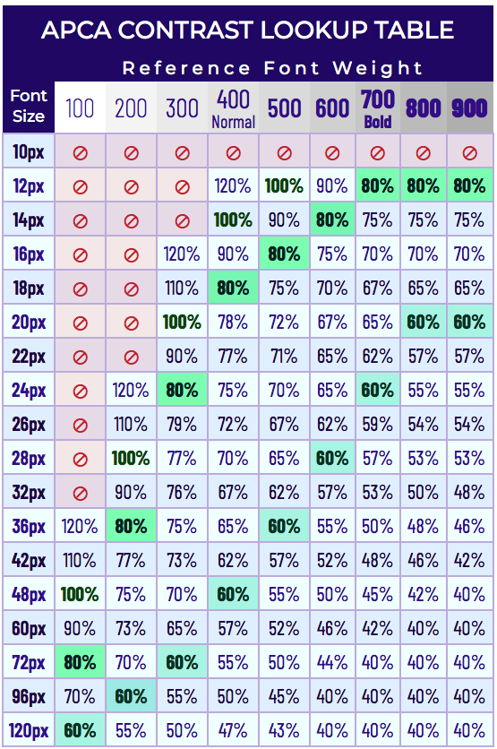
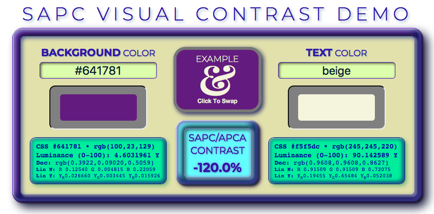

## Important: 
Files that are intended for supporting the Silver/WCAG 3 conformance model all have **APCA** in the file name. Files with SAPC in the name are part of ongoing research and should NOT be used for developing conformance tools.

# CURRENT VERSION: Beta 0.97h (JS 0.97h2)
## (Oct 23, 2020, 17:00 GMT)
### Change Notices:
[ImportantChangeNotices.md]:ImportantChangeNotices.md

If you have been using any files from this repository, be sure to read the file "[ImportantChangeNotices.md]" for critical updates that may affect results.

-----

# SAPC/APCA

## SAPC _(S-LUV Advanced Perceptual Contrast)_
### APCA _Advanced Perceptual Contrast Algorithm_

This is a set of contrast assessment methods for predicting perceived contrast between sRGB colors on a computer monitor. It is intended as an assessment method for standard relating to content for computer displays and mobile devices.

### FEATURES

* Spectral weighting of luminance based on sRGB coefficients.
* Weighting for normal and reverse polarity (dark text on light background vs light text on dark.)
* Estimation and weighting of light adaptation for perceptual uniformity in a common "standard observer" model.
* Considers Bartleson Breneman surround effects, simultaneous contrast, and local adaptation based on a pre-estimation model.
* Spatial frequency considerations for font weight as part of calculations and defined in a lookup table.

### FEATURES IN DEVELOPMENT
* Additional weighting for RED/GREEN/BLUE to enhance contrast for accommodating Color Vision Deficiencies, glare, and provide better design guidance.
* Incorporate Spatial Frequency & stimulus size directly in predictions (no lookup table).
* Calculate multi-way contrasts and total effective page luminances for dynamic calculation of surround effects, simultaneous contrast, and local adaptation.
* Calculate the effect of opacities.

----- 

## LOOKUP TABLE
The image of the lookup table below is used with the contrast value output from APCA to indicate a minimum font size and weight.

- Cross index reference font size (in CSS px) to CSS weight.
- Reference fonts for comparison include Helvetica Neue, Helvetica, K2D, Fira Sans, Kanit, and Arial.
- APCA Contrast Percentage must meet or exceed the value listed.
- For light text on a dark background the APCA tool will show a negative percentage. Simply use the absolute (positive) value. For example, if the APCA value is -58%, use 58%.
- A **⊘** indicates that a larger font size (or heavier font weight) must be used.

### [LIVE VERSION][SAPCsite]
There is a working version with examples and reference material on [the author's site:
][SAPCsite]

[SAPCsite]: https://www.myndex.com/SAPC/

           
-----
## Miscellaneous

There is an informal and unofficial repository of information on vision, contrast, design, impairments, and readability at the [Visual Contrast Subgroup Wiki].

[Visual Contrast Subgroup Wiki]:https://www.w3.org/WAI/GL/task-forces/silver/wiki/Visual_Contrast_of_Text_Subgroup

### S-Luv/S-Lab

* S-Luv, is a Ls usvs-type colorspace for modeling vision and visual impairment perception of emissive displays and devices. 
    * S-Luv is built around the concept of a standard-observer/standard-environment model.
        * the standard observers for visual acuity (VA) are grouped as: 
            * 20/40 and better (near normal), 
            * 20/40 through 20/80 (transitional impairment) and
            * 20/80 to 20/200 (Low Vision)
        * The standard observers for contrast sensitivity (CSF) are
            * Pelli Robson 2 (normal, 1% threshold)  
            * Pelli Robson 1.5 (impaired, 3% threshold)  
            * Pelli Robson 1 (Low Vision, 10% threshold)
        * The standard observers for Color Vision Deficiency are
            * A Protanope (no red cones)
            * A Deuteranope (no green cones)
            * Both Protan and Deutan are addressed at the same time.
            * The standard observers for contrast sensitivity are (under revision / TBD)
        * It is important to remember that VA and CSF are the threshold levels between legible and not legible, but do not specify the idea readability conditions.
 

### SAPC Standard Observer Monitor (preliminary)
These are preliminary thoughts for a standard observer model. In particular, some further research and empirical studies that sample how users tend to set their monitor's brightness/contrast and the effect on the resultant display gamma/TRC.

* The standard environmental model is a desktop sRGB LCD screen calibrated for 
   * Max White (#FFF) Luminance no less than 160cd/m^2 
   * Max White Luminance no more than 240cd/m^2 
   * Black level target of 1 cd/m^2, and no more than 2 cd/m^2
   * Gamma curve of no less than 2.2, and no more than 2.5
   * Preferred gamma target similar to L*, between 2.3 and 2.4
   * Ambient light of approximately 200 lux.
       * The light should not _directly_ shine on the face of the monitor.
       * The light should not shine into the eyes of the user while viewing the monitor.
       * The previous 18% greycard method was deleted as being problematic.
       * What is actually important is that the area within view surrounding the monitor be at ~20% luminance of the monitor's max white level. If the monitor is surrounded by 80% white walls then it is those 80% walls that need to be at 20% luminance of the monitor's max white as calibrated.
      * Send the sRGB monitor full screen grey at sRGB value #7C7C7C.
      * The average luminance of the area in view around the monitor should be the same as the monitor grey at #7C7C7C.
      * The monitor at #FFFFFF should measure a luminance approximately five times higher than that measures at #7C7C7C.
   * Position monitor toward user in a way that minimizes reflections.
   * Background behind the monitor within the users field of view should be neutral, and about 20% of the monitor's maximum white luminance.

### IMPLEMENTATIONS

At the moment, this is plain vanilla Javascript. As this develops we hope to include PHP 5.5, and OpenOffice Calc spreadsheet, as those cover the most likely use cases. Many of the available inputs to the functions can remain at their defaults, thought these extra inputs can be used in more specialized situations (such as creating content specifically for daylight/outdoors, or specifically for dark nights, etc.).

### THIS IS BETA
Being developed for use with future web standards for accessibility. Those are under separate repositories.
