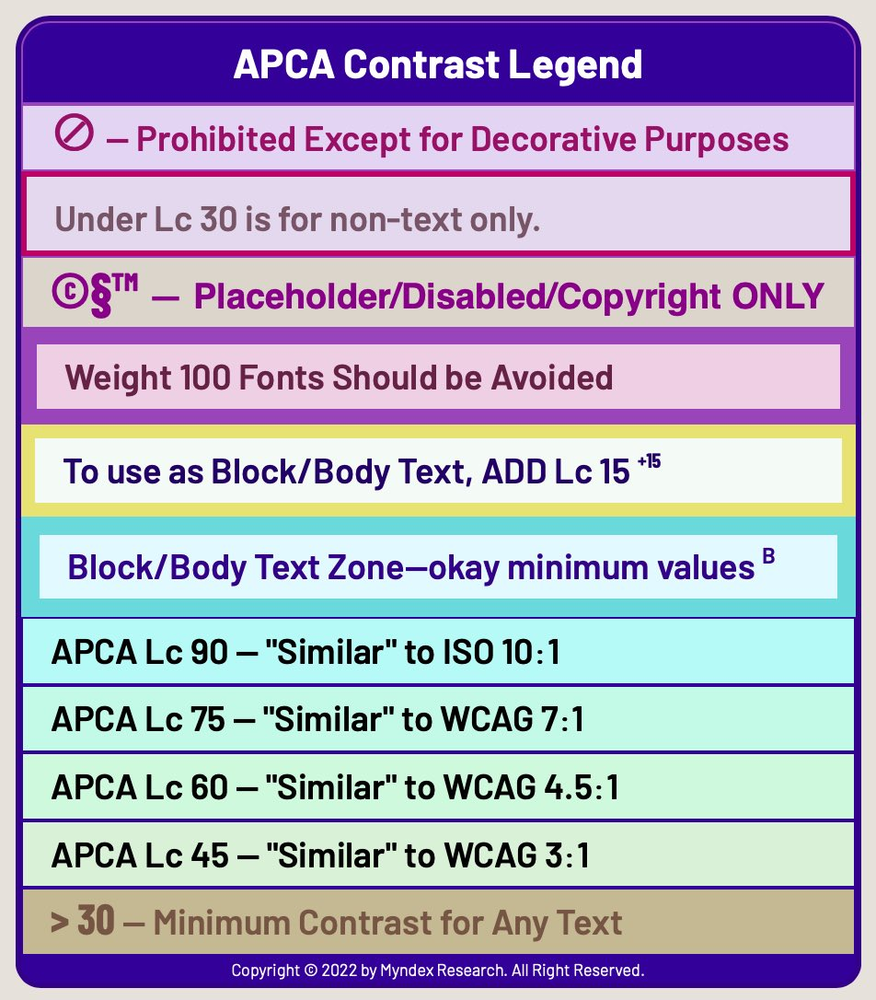
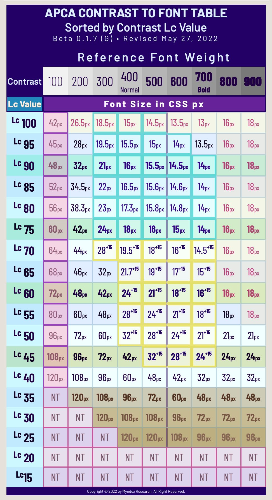

<p align="center">
 <br><br>
  
  <a href="https://npmjs.org/package/apca-w3">
    
  </a> &nbsp;&nbsp;
  <a href="https://npmjs.org/package/apca-w3">
    
  </a> &nbsp;&nbsp;
  <a href="https://github.com/Myndex/SAPC-APCA">
    
  </a> &nbsp;&nbsp;
<br>
  <a href="https://github.com/Myndex/SAPC-APCA/blob/master/LICENSE.md">
    
  </a> &nbsp;&nbsp;
  <a href="https://twitter.com/MyndexResearch">
    
  </a> &nbsp;&nbsp;
  <a href="">
    
  </a>
</p>

-----
# APC<span class="flipH">A</span> • SAPC • SAC<span class="flipH">A</span>M PRIMARY REPOSITORY
Please make all comments or discussions here and not in the satellite repositories.

## Accessible Perceptual Contrast Algorithm
(Formerly the Advanced Perceptual Contrast Algorithm)

### Source and Data
- JS arrays and tab-delimited data of the font Lookup tables is [in the data folder](https://github.com/Myndex/SAPC-APCA/data/).
- The APCA and BridgePCA web-tools are  [in the WEBTOOLS folder](https://github.com/Myndex/SAPC-APCA/WEBTOOLS/).
- There are ported versions [in the src/ported folder](https://github.com/Myndex/SAPC-APCA/src/ported/).

## _DOCUMENTATION_
- [**Main Readme Doc** (THIS, HTML version)](https://git.apcacontrast.com/documentation/README)

### _Simple Overview, Quickstart, and FAQ_
These are intended for end users, and those interested in a plain language overview without a lot of the math & theory.
- [**Why APCA?**](https://git.apcacontrast.com/documentation/WhyAPCA) A basic overview
- [**APCA in a nutshell**](https://git.apcacontrast.com/documentation/APCA_in_a_Nutshell) The minimum user guide
- [**APCA FAQ**](https://git.apcacontrast.com/documentation/APCA_FAQ)

### _Sciencey Stuff!_
Maths! Vision Science! Photons on Parade!
- [The base APCA-W3 formula](https://github.com/Myndex/SAPC-APCA/blob/master/documentation/APCA-W3-LaTeX.md) in LaTeX math for your viewing and calculating pleasure.
- [Regarding Exponents](https://git.apcacontrast.com/documentation/regardingexponents) Some notes and explaination regarding the powercurve exponents.
- [Standard Observer Model](https://git.apcacontrast.com/documentation/StandardObserverModel) Draft standardized envirnment.
- [Visual Contrast Draft Whitepaper](https://www.w3.org/WAI/GL/task-forces/silver/wiki/Visual_Contrast_of_Text_Subgroup/Whitepaper) (Work in progress)

### _For Developers_
- [RepoList](https://git.apcacontrast.com/documentation/repoList) of the related satellite repositories.
- [Important Change Notices](https://git.apcacontrast.com/documentation/ImportantChangeNotices) mainly breaking changes listed here.
- [How to Contribute](https://git.apcacontrast.com/documentation/CONTRIBUTING) <span style="background-color:#cde;padding:3px;border-radius: 3px;">🎶</span>help us if you can<span style="background-color:#cde;padding:3px;border-radius: 3px;">🎵</span>
- [A License](https://git.apcacontrast.com/documentation/LICENSE) to calc.
- [Minimum compliance](https://git.apcacontrast.com/documentation/minimum_compliance) to use "APCA" and related trademarks.

### _Related Repositories_
- [**_APCA W3 Repository_**](https://github.com/Myndex/apca-w3) The W3 version for web content
- [**_Bridge PCA Repository_**](https://github.com/Myndex/bridge-pca) Bridge&nbsp;PCA - the WCAG&nbsp;2 compatible version
- [**_Color Parsley Repository_**](https://github.com/Myndex/colorparsley) Fast and easy color string parsing — a NodeJS dependency for many of the SAPC libraries.

### THIS REPOSITORY, [and apca-w3](https://github.com/Myndex/apca-w3) ARE THE ONLY CANONICAL SOURCES OF APPROVED APCA CODE.

## Bridge PCA
Do you want to improve readability, but you are forced to used WCAG 2 contrast to the letter? Then Bridge PCA is for you. It is backward compatible with WCAG 2, but using APCA technology.
SEE: [**_Bridge PCA Repository_**](https://github.com/Myndex/bridge-pca) 

## _W3 Licensed Files Moved_
**All files that are part of and licensed to the W3 and AGWG, in support of WCAG&nbsp;3, are now in their own repository.**

SEE: [**_APCA W3 Repository_**](https://github.com/Myndex/apca-w3) and please source all files for tools intended for WCAG&nbsp;3 conformance from that specific repository. The files in this repositiory are part of other projects, and not necessary for WCAG&nbsp;3 compliance.

-----
### Got Questions? We Got Answers!
- [**_Open a discussion today!_**](https://github.com/Myndex/SAPC-APCA/discussions)
## Accessible Perceptual Contrast Algorithm in a nutshell
APCA was developed independently as a part of the future WCAG&nbsp;3 standards, with the guidance and oversight of members of the W3 AGWG, Members of the US Access Board, and members of the accessibility community at large. All participants, beta testers, early adopters, are deeply thanked for their comments and contributions to the development of the APCA. Readability is for all!

- APCA uses modern vision science and is perceptually uniform.
- Studies demonstrate that APCA for WCAG&nbsp;3 is superior to WCAG&nbsp;2.x contrast methods.
- APCA can be used today as an independent standard to provide excellent guidance for contrasts for readability and understandability of web content.
    - however, WCAG&nbsp;3 is not an official standard yet, and it is useful to note that APCA it is _not_ backwards compatible with WCAG&nbsp;2.x.
    - This is mainly an issue if you have a contrasctual obligation or law to follow that demands WCAG 2 AA as a web standard.
    - Unfortunately WCAG 2 is substantially incorrect in certain areas of perception due to its basis on older standards and technologies. It is due to this that APCA was developed as the replacement for use in WCAG&nbsp;3, as a result complete backwards compatibility is not possible.
- The discussion tab is open here if you have questions or comments.
- This repo includes the basic APCA code, which returns a perceptually uniform contrast value.
- This iteration has been stable since February, future iterations of course planned.
    - While it is still pre-release beta, the general functioning is demonstratively useful.
    - This version is set for sRGB, a next iteration will change the inputs to allow any additive colorspace.
 - You _CAN_ use APCA simply to evaluate a perceived contrast (such as Lc&nbsp;75). But ALSO:
     - There are a variety of lookup tables that can be used to relate a contrast to a font size and weight.
     - Rounding the contrast to an integer is allowed, and interpolation can be used with a lookup table.
 - For simplicity, you can also use the "simple key levels" method (Lc&nbsp;45, 60, 75), which compares to WCAG 2 contrast (with one very light color) as:
     - Lc&nbsp;45 is "sort of" like 3:1
     - Lc&nbsp;60 is "sort of" like 4.5:1
     - Lc&nbsp;75 is "sort of" like 7:1
 - Unlike WCAG_2, APCA is polarity aware, so the BG and TEXT colors _must_ be sent to the correct inputs.

Please feel free to use the discussion area for any questions or comments.

## Why APCA

See [WHY APCA](WhyAPCA.md) for a brief explaination of the important differences of APCA for WCAG&nbsp;3 vs the old WCAG&nbsp;2.x/1.4.3 contrast guidelines.

### SAPC and APCA demo tools are live to play with.

**The basic simple version[ is the APCA page,](https://www.myndex.com/APCA/)** it includes the new scaling and the dynamic font matrix. The is the official WCAG3/Silver support version.

**The development version[ is the SAPC page,](https://www.myndex.com/SAPC/)** and this version includes the new RESEARCH MODE, which has some different tools you can activate to investigate the nature of a color or colors, including a simplified version of the middle contrast experiment - on the SAPC app it's called "split contrast mode".


## APCA is the _Accessible Perceptual Contrast Algorithm_

APCA is a set of contrast assessment methods for predicting perceived contrast between sRGB colors on a computer monitor. It has been developed as an assessment method for W3 Silver/WCAG3 accessibility standards relating to content for computer displays and mobile devices.

### BASIC FEATURES
* Incorporates Spatial Frequency & Stimulus Size directly in predictions.
* Spectral weighting of luminance based on sRGB coefficients.
   - NEW: displayP3 added, AdobeRGB next.
* Separate weighting for normal and reverse polarity (dark text on light background vs light text on dark, aka dark mode.)
* Estimation and weighting of light adaptation for perceptual uniformity in a common "standard observer" model (see below).
* Spatial frequency considerations for font weight as part of calculations and further defined in a lookup table. (I.e. values Lc 60 and higher are weighted for fonts less than 24px, values less than Lc60 are weighted for large fonts and non text).
* Lookup table can be customised for different languages/character sets.

----- 
### [LIVE VERSION](https://www.myndex.com/APCA/)
There is a working version with examples and reference material on [APCAsite](https://www.myndex.com/APCA/)

-----
### Font Use Lookup Table

Latest Lookup Table: May 27 2022







------

### THIS REPOSITORY, [and apca-w3](https://github.com/Myndex/apca-w3) ARE THE ONLY CANONICAL SOURCES OF APPROVED APCA CODE.

If you are integrating code, please check here for official changes, or at apca-w3 for the W3 licensed version. This code is considered beta, and will change periodically. The repo for WCAG_3 compliance is [apca-w3.](https://github.com/Myndex/apca-w3)

Files with **RESEARCH** or **DEV** in the name are part of ongoing research and should _NOT_ be used for developing conformance tools, and further are not licensed for use in distributed software, and should be considered experimental only.

**NOTICE: There are some obsolete code listings on some legacy working drafts of Silver aka WCAG 3. **These should not be used and are not compatible** with the current or future versions. If you developed code around these please let us know! We can help facilitate transitioning to the correct code and constants.**

[Visual Contrast Subgroup Wiki]: https://www.w3.org/WAI/GL/task-forces/silver/wiki/Visual_Contrast_of_Text_Subgroup

## IMPLEMENTATIONS
The base libraries are plain vanilla Javascript. Other languages may be in the "PORTS" folder. Many of the available inputs to the functions can remain at their defaults, though these extra inputs can be used in more specialized situations (such as creating content specifically for daylight/outdoors, or specifically for dark nights, etc.). 

A plain language walkthrough, LaTeX math, and related supporting information is below:

### APCA 0.1.9 4g constants and math

APCA is the **A**ccessible **P**erceptual **C**ontrast **A**lgorithm. The math below assumes the use of the web standard sRGB colorspace.
```javascript
 // 0.98G-4g full range version constants:
    
  Exponents =  { mainTRC: 2.4,       normBG: 0.56,       normTXT: 0.57,     revTXT: 0.62,     revBG: 0.65, };
  
  ColorSpace = { sRco: 0.2126729,    sGco: 0.7151522,    sBco: 0.0721750, };
    
  Clamps =     { blkThrs: 0.022,     blkClmp: 1.414,     loClip: 0.001,     deltaYmin: 0.0005, };
        
  Scalers =    { scaleBoW: 1.14,     loBoWthresh: 0.035991,  loBoWfactor: 27.7847239587675,  loBoWoffset: 0.027, 
                 scaleWoB: 1.14,     loWoBthresh: 0.035991,  loWoBfactor: 27.7847239587675,  loWoBoffset: 0.027, };	
```    

### The Plain English Steps Are:

- Convert the sRGB background and text colors to luminance: Y<sub>background</sub> and Y<sub>text</sub>
    - Convert from 8 bit integer to decimal 0.0-1.0
    - Linearize (remove gamma - shown in next step by applying a ^2.4 exponent
    - Apply sRGB coefficients and sum to **Y**
        - Y = (R/255)<sup>^2.4</sup> * 0.2126 + (G/255)<sup>^2.4</sup> * 0.7152 + (B/255)<sup>^2.4</sup> * 0.0722
    - We will call these Y<sub>text</sub> and Y<sub>background</sub>
- Determine if Y<sub>text</sub> or Y<sub>background</sub> is brighter (higher luminance, for contrast polarity)
    - Soft-clamp the colors but **only** if it is less than **0.022 Y**
        - **Soft Clamp:** subtract the color **Y** from 0.022 
        - Then apply a ^1.414 exponent to the result
        - Then add that result back to the Y of the darker color
            - clampedY = ( 0.022 - Y )<sup>^1.414</sup> + Y
- Apply power curve exponents to both colors for perceptual contrast
    - For dark text on a light background, use ^0.57 for Y<sub>text</sub> and ^0.56 for Y<sub>background</sub>
    - For light text on a dark background, use ^0.62 for Y<sub>text</sub> and ^0.65 for Y<sub>background</sub>
- Subtract Y<sub>text</sub> from Y<sub>background</sub>
    - **Always** subtract the Y<sub>text</sub> value from the Y<sub>background</sub> value ( BG - TXT )
        - For light text on a dark background, this will generate a negative number. 
        - This is intentional, so that negative values indicate light text on dark BGs, and positive values only indicate dark text on a light BG.  
- Multiply by the scale 1.14
    - THEN if the absolute value is less than threshold 0.1 return "contrast too low"
    - ELSE if positive, subtract the offset 0.027 and then multiply by 100 for Lc
    - ELSE if negative, add the offset 0.027 and then multiply by 100 for Lc
- Finally: compare the Lc value to the font lookup table for the language being used to determine the minimum font size and weight. 

-----

Basic APCA Math in LaTeX
----------
0.0.98G-4g-base W3 (apca-w3 0.1.17)


NOTICE: "APCA is a method for predicting text contrast on self-illuminated displays for web-based content. Some use-cases are prohibited by license, including the following: use in medical, clinical evaluation, human safety related, aerospace, transportation, military applications, are strictly prohibited without a specific license in writing granting such use."

-----
## TESTING YOUR IMPLEMENTATION

If you've implemented the code and want a quick sanity check, Here are some keystone checks with no rounding. The first color is **TEXT** and the second color is **BACKGROUND**:

```text
Test Values for APCA W3 using the G series constants, normal and reverse float values for each color pair.
First number is TEXT second number is BACKGROUND.

    TEXT vs BKGND •  EXPECTED RESULT for APCA W3 to 0.1.9 (G-constants)

    #888 vs #fff  •  63.056469930209424
    #fff vs #888  • -68.54146436644962  

    #000 vs #aaa  •  58.146262578561334
    #aaa vs #000  • -56.24113336839742
    
    #123 vs #def  •  91.66830811481631
    #def vs #123  • -93.06770049484275

    #123 vs #444  •   8.32326136957393
    #444 vs #123  •  -7.526878460278154

The below are only for certain experimental low-scale versions, these tests do *not* acpa-w3:
    #123 vs #234  •   1.7512243099356113
    #234 vs #123  •  -1.6349191031377903
```

These exercise all the important constants.

-----


-----
## Miscellaneous

### THIS IS BETA
Being developed for use with future web standards for accessibility. Those standards are under separate repositorieswith the W3/AGWG.

## OTHER RESOURCES

### _The Myndex_ [_APCA Linktree_](https://linktr.ee/Myndex)
- A small list of [links](https://linktr.ee/Myndex) relating to APCA contrast and color. The more basic, plain language documents and articles at the top, and then lower on the link list, incresingly technical resources.

### _The Myndex Color and Contrast_ [_Resource Page_](https://git.myndex.com)
- A much larger list than the linktree. How deep do you want to jump down this rabbit hole?

### [_Visual Contrast Subgroup Wiki_](https://www.w3.org/WAI/GL/task-forces/silver/wiki/Visual_Contrast_of_Text_Subgroup)
- An informal and unofficial repository of information on vision, contrast, design, impairments, and readability at the [Visual Contrast Subgroup Wiki] which includes "Whitepaper In Progress" materials.
    - [Visual Contrast Whitepaper](https://www.w3.org/WAI/GL/task-forces/silver/wiki/Visual_Contrast_of_Text_Subgroup/Whitepaper) (Work in progress)
    - [Resources: Glossary, Bibliography,](https://www.w3.org/WAI/GL/task-forces/silver/wiki/Visual_Contrast_of_Text_Subgroup/Resources) and links to team member materials. Includes additional designer examples and guidance.

The [author's website](https://www.myndex.com/WEB/Perception) includes further background, including select experimental results and white-papers


-----
## DISCLAIMER

_DISCLAIMER AND LIMITATIONS OF USE:_      
APCA is an embodiment of certain suprathreshold contrast        
prediction technologies. Versions marked as licensed to         
the W3 are strictly limited to web content use only for        
supporting certain accessibility guidelines.

APCA code listed here is provided as is, with no         
warrantees expressed nor implied. We accept no         
liability for any use or misuse of the code.         
Suitability of  purpose resides with the         
integrator or end user.

Commercial use is prohibited without a written         
and signed commercial license agreement.

Non-commercial use is permitted only for         
predicting contrast for web content, no         
other use case is authorized.

License excludes other use cases not related to web         
content. Prohibited uses include and are not limited         
to medical, clinical evaluation, human safety related,         
aerospace, transportation, military applications, and         
uses which are not specific to web-based content         
presented on self-illuminated displays or devices.

-----


Glossary
--------

-   **Light** — visible light is energy in a narrow range of frequencies or wavelengths that can be detected or sensed by "photo sensitive cells" in the back of the eye. 
-   **Color** — color is not real, but a perception or interpretation by visual processing in the brain (in the brain's visual cortex) of stimulus from photosensitive cells in the eye. 
    -   **Hue** — refers to a particular color sensation, i.e. red, green, yellow, blue, etc. Hue does not exist in reality, it is solely the perception of the visual system responding to light of different frequencies.
    -   **Saturation** — the color intensity or purity, reduced by:
        -   **tint** (add white), 
        -   **shade** (add black), 
        -   **tone** (add grey), 
-   **Brightness** — a relative perception, see also perceptual lightness.
-   **Luminance (Y or L)** — a physical measure of visible light intensity. Luminance is mathematically linear as light is in the real world.
-   **Perceived Lightness `(L*)`** — the perception of physical light intensity. Perceptual lightness is mathematically nonlinear in regards to light in the real world, however, some perceptual models attempt to provide a mathematically linear version of perception which then presents light as non-linear. The symbol L* refers to `CIE L*a*b*`, and should not be confused with luminance L.
-   **Luma (*Y'* prime)** — is a gamma encoded, weighted signal used in some video encodings. It is not to be confused with linear luminance.
-   **Gamma** — or transfer curve (TRC) is a curve that is commonly applied to image data for storage or broadcast to reduce perceived noise and improve data utilization.
-   **Contrast** — is a perception of the difference between two objects/elements. There are many forms of contrast, and the different types of contrast interact with and are affected by each other as well as being affected by other aspects of vision.
    -   **Lightness contrast:** the difference in lightness and darkness between two items. This is a particularly important form of contrast for information such as text.
    -   **Spatial contrast:** in other words contrasts of size. Size contrasts directly affect the perception of lightness contrasts.
    -   **Hue contrast:** the perception of different light frequencies. Hue contrasts are three times weaker than lightness contrasts, and some people have problems perceiving some hues, so hue should never be a primary design contrast.
    -   **Positional contrasts:** the distance and/or orientation between objects is important in object recognition and identification.
    -   **Temporal contrasts:** contrasts of time, speed, and change. 
-   **Visual Acuity** — acuity refers to the ability of the eye's optics to focus light onto the photoreceptors on the back of the eye.
    -   Poor acuity is usually understood as blurry vision or an inability to focus.
-   **Spatial Frequency** — in a practical sense, this refers to the weight of a font, or the stroke width. A thinner font or narrower stroke width is a higher spatial frequency than a bolder or thicker stroke. Higher spatial frequencies require more luminance contrast to be visible than lower frequencies, such as a very bold large headline.


------


### Change Notices:
[ImportantChangeNotices.md]: ImportantChangeNotices.md

If you have been using any files from _this_ repository, be sure to read the file "[ImportantChangeNotices.md]" for critical updates that may affect results.

## SAPC/APCA CURRENT VERSION: 0.1.1 Constants: 4g

### January 27 2022
Font lookup table revised, now LUT ver  0.1.5 G constants. New the arrays in the data folder. More uniform response across multiple font families, and improved acuity weighting.

### January 18 2022
Font lookup table revised, still for 4G constants. Tighter conformance now. 

### January 2 2022
Font lookup table revised, still for 4G constants.

### December 1, 2021
All W3 licensed files moved to their own repository, AND     
**A new npm package has been released (of the W3 version) to ease integration!!**

### November 23, 2021
Adopting semantic versioning, adding a first 0. so the current version is **0.0.98G**

### November 17, 2021
Please see the new font lookup table (LUT3) (on this page, below)

### October 1, 2021
The base APCA with the 0.0.98G-4g constants is in the JS folder. 

### NEW CONSTANTS and NEW MATH:
(October 1, 2021) the 0.0.98G-4g math and constants have been in use now for months, and by all accounts are working well as expected. The revised code is available in the JS folder. The present version improves tracking of contrast perception. (Doubling or halving the L<sup>c</sup> value results in a perceived doubling or halving of contrast.) Also, smoother results for low contrasts and dark color pairs.

-----

-----
## _Accessibility Statement for Beta Sites_
_At their option, beta testers, early adopters, and sites using APCA to determine text and non-text contrast may wish to include the following statement in their site's boilerplate:_

-----
## APCA Accessibility Statement v0.1.9
**This website is beta testing the APCA guidelines for determining text and non-text contrast. It is well known that WCAG 2 contrast maths and methods are not accurate regarding human perception of text, as a result automated testing using WCAG 2 maths may incorrectly indicate errors in some color pairs on this site. The APCA guidelines are a substantial improvement in accessibility over WCAG 2 contrast criterions, and therefore compliant with the ADA. Compliance with US Access Board 508 rules is per the alternative methods section. Compliance in other jurisdictions subject to evaluation. Any automated testing done to determine conformance of this site must be conducted using a perceptually accurate method of predicting text contrast, such as APCA. WCAG 2.x math, methods, and success criterion are notwithstanding.**

### This Site is Tested With APCA-W3 Version: &lt; _insert valid guidelines version here_ &gt;
_End Accessibility Statement_

----

_For giggles:_
### More glossary of confusing terms and "bonus sciencey stuff" in [The Lighter Side of Light](https://gist.github.com/Myndex/b956e5320f77cfd5c3cf451f4ce0acb5#the-lighter-side-of-light)


### _THE REVOLUTION WILL BE READABLE_<sup>™</sup>

 

-----
<sub>**Disclaimer:** _APCA is being evaluated as a replacement for WCAG 2 contrast math for future standards and guidelines, however, standards that will be incorporating APCA are still developmental. Because WCAG 2 contrast math does not accurately model human visual perception nor visual impairments, there will be discrepancies between WCAG 2 contrast math, and perceptually uniform models such as APCA. It is up to the end user to determine suitability of purpose for their region and conformance requirements._</sub>
